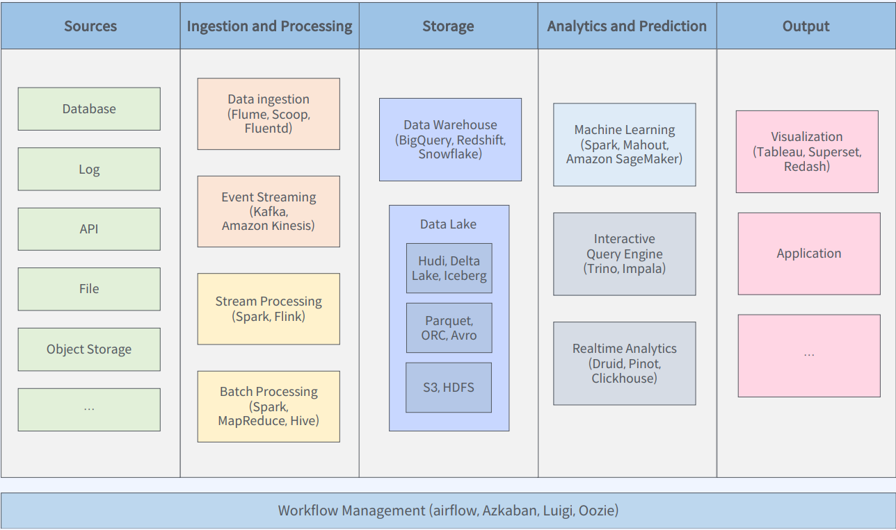

### 데이터의 종류
1. 정형 데이터 (스키마 존재)  
   ex) 관계형 데이터베이스, 스프레드시트
2. 비정형 데이터 : 데이터웨어하우스에 저장  
   ex) 정리되지않은 텍스트, 이미지, 음성, 영상
3. 반정형 데이터(스키마 포함)  
   ex) Json, xml, 웹로그, 센서데이터

# 빅데이터 아키텍처 개요
</img>

> 데이터 Source 종류
- 데이터베이스 (OLTP)
- 이벤트 컬렉터 : 사용자가 만드는 데이터
- 로그 : 웹서버의 로그
- API : 외부 서비스로부터 데이터를 가져오기 위함
- 파일
- 오브젝트 스토리지

 OLTP VS OLAP
| OLTP            | OLAP              |
| --------------- | ----------------- |
| 트렌젝션이 많다 | 데이터가 많다     |
| 빠른처리        | 느린쿼리          |
| 정규화된 데이터 | 비정규화된 데이터 |
| 테이블이 많다   | 데이블이 적다     |
| 현재 데이터     | 이력데이터        |

> 수집 + 처리

수집
| 배치형                                      | 스트리밍형                                 |
| ------------------------------------------- | ------------------------------------------ |
| 이미 어딘가 존재하는 데이터를 정리해서 추출 | 지속적으로 들어오는 데이터를 수집하는 경우 |
| 데이터베이스나 파일서버                     | 애플리케이션 이벤트, 로그, 센서데이터      |

처리
| 배치형                 | 스트리밍형          |
| ---------------------- | ------------------- |
| Mapreduce, Spark, Hive | Flink, Spark, Kafka |

> Storage

- DataWareHouse, DataLake
- Google BigQuery
- Amazon READSHIFT
- Snow Flake

> 분석 + 예측
- 대화형 쿼리엔진 -> trino
- 실시간 분석을 지공 -> druid, pinot, clickhouse
- 머신러닝 -> Spark, AmazonSageMaker, Azure

> Output 
- 데이터를 시각화하여 대시보드로 보여준다.
- 데이터 기반 의사결정 (비즈니스 의사결정 도와줌)
- 데이터 기반 애플리케이션 

> Workflow Management
- 각 단계들을 연결하여 파이프라인을 구성한다.
- Aflow, Luigi, oozie, 아즈카반

