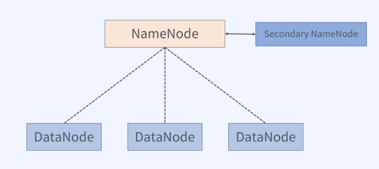

# Hadoop 기초
> Hadoop 구성요소
- Mapreduce : 분산데이터처리
- Yarn : 리소스 관리자
- HDFS : 분산 파일 시스템  
*Hadoop ecosystem 프로젝트는 일반적으로 Hadoop과 독립적으로 개발된다.(=모든 Hadoop ecosystem이 Hadoop에 의존 X), 하둡의 일부 시스템을 이용하는 프로젝트가 존재할 뿐.*

# HDFS
- 분산 파일 시스템 : 네트워크로 연결된 여러 머신의 스토리지를 관리하는 파일 시스템

>HDFS 특징
- 범용 하드웨어를 사용하여 분산 파일 시스템 구성
- 블록 단위 저장
- 마스터/워커 구조
- 내고장성 제공 (= 데이터를 복제하여 일부 장애가 발생하더라도 계속 서비스 사용가능)
- 확장성 제공
- 블록 캐싱 기능 제공 (= 데이터노드에 저장된 데이터 중에서 자주 읽는 블록을 데이터노드의 메모리에 명시적으로 캐싱한다.)
- 고가용성 지원

> Block  단위 저장
- 하나의 파일을 여러 블록으로 저장
- 실제 파일크기가 블록사이즈보다 작을 경우 파일 크기만큼만 디스크 사용

> HDFS Block이 큰 이유?
- 일반적인 디스크 블록에 비해 크다.(128MB)
- 탐색 비용 최소화
- 블록의 시작점을 탐색하는데 적게 걸린다.
- 메타 데이터 크기 감소

> Block 단위 처리 이점
- 파일 하나의 크기가 실제 하나의 물리 디스크 사이즈보다 커질 수 있음
- 스토리지 관리 단순화
- 내고장성과 가용성을 지원하는 복제기능 지원 적합

> HDFS 구조(master/worker 구조)

</img> 

</img>  
*데이터노드 하나에 장애가 발생하여도 데이터를 읽을 수 있다.*

### namenode
- 메타데이터 관리
  - 파일시스템이미지 : 네임스페이스를 포함한 데이터의 모든 정보
  - EditLog : 데이터노드에서 말생한 데이터 변환 내역
- 데이터노드 관리

### Secondary namenode
- namenode의 Standby 역할이 아님.
- 체크 포인트
  - 파일시스템이미지와 EditLog를 주기적으로 병합
- 주기적으로 namenode의 파일시스템이미지를 백업

### datanode
- 실제 파일을 로컬 파일 시스템에 HDFS 데이터를 저장
- 하트비트를 통한 데이터노드 동작 여보 전달
- 저장하고 있는 블록의 목록을 주기적으로 namenode에 보고

> HDFS의 읽기 연산
> 
</img>  
1. 파일이 보관된 블록의 위치를 요청한다.
2. 블록이 어디에 있는지 클라이언트에게 반환한다.
3. 파일블록을 요청한다.
4. 데이터를 읽는다.

> HDFS의 쓰기 연산
> 
</img>  
1. 파일정보를 전송, 파일블록을 써야할 노드의 목록을 요청받는다.
2. 데이터를 쓸 노드의 리스트를 클라이언트에게 전달한다.
3. 파일쓰기를 요청한다.
4. 노드간 복제를 진행
5. 복제 진행이 완료되면 에크 정보를 받게 된다.
