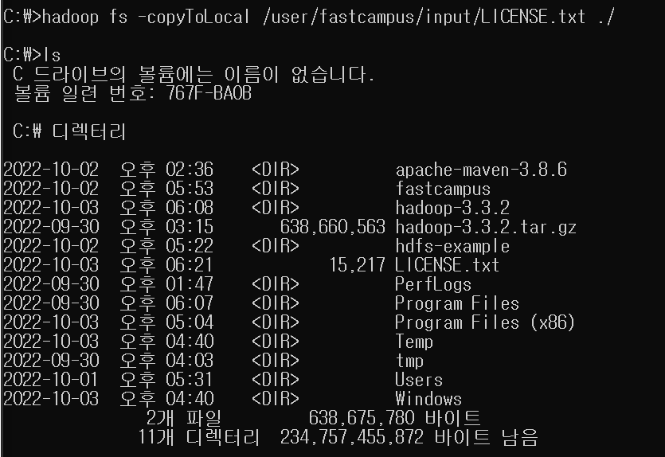
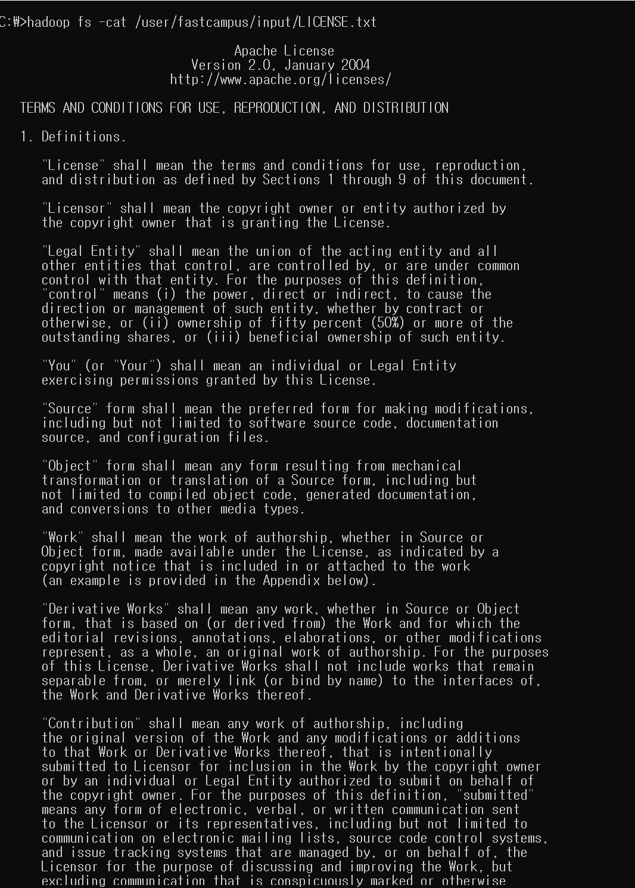
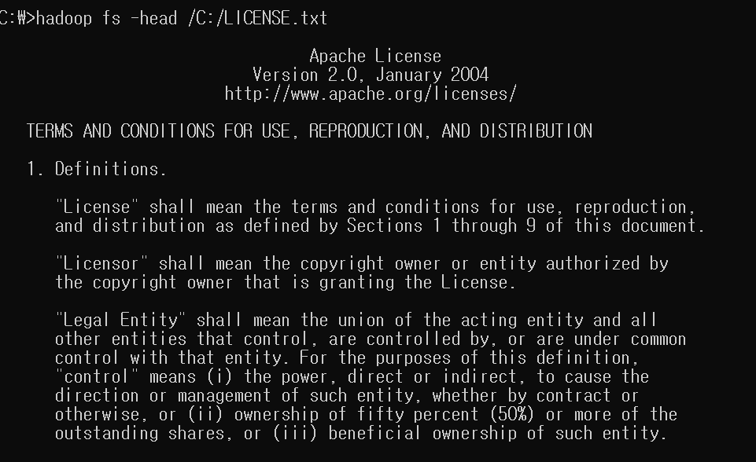

# HDFS 클러스터 구동
hdfs namenode -format  
cd sbin  
start-dfs.cmd  
start-yarn.cmd  

# CLI (Command Line Interface) 실습

## HDFS CLI를 실행하는 방법(명령어)
1. hadoop fs : local, hdfs 등과 같은 파일 시스템을 가리킬 수 있는 일반 파일 시스템과 관련있다.
2. hdfs dfs : HDFS에만 해당하는 명령어이다. 

** FS쉘에는 HDFS와 직접 상호작용하여 다양한 명령과 Local FS, WebHDFS, S3 FS 등과 같은 hadoop이 지원하는 다른 파일 시스템이 포함되어 있다. 

> hadoop fs 실습시작
1. hadoop fs상에 디렉토리 생성  
   : C:\hadoop-3.3.2>hadoop fs -mkdir /user // 유저생성  
   *HDFS 내에 사용자의 홈 디렉터리는 “/user/사용자이름”으로 생성*  
   : C:\hadoop-3.3.2>hadoop fs -mkdir /user/fastcampus  
   : C:\hadoop-3.3.2>hadoop fs -mkdir /user/fastcampus/input  
   : C:\hadoop-3.3.2>hadoop fs -ls /user/fastcampus  // 정상적으로 생성된 것을 확인

2. 로컬에 있는 파일이나 디렉토리를 hdfs에 업로드 하기  
   1) hadoop fs -put LICENSE.txt /user/fastcampus/input
   2) C:\hadoop-3.3.2>hadoop fs -ls /user/fastcampus/input // 업로드되었는지 확인

1. hdfs상에 존재하는 데이터를 로컬파일시스템으로 옮겨오기
   - hadoop fs -copyToLocal /user/fastcampus/input/LICENSE.txt ./ //./현재 디렉토리에 가져오기

1. hdfs상에 업로드되어있는 파일을 볼 수 있는 역할
   - hadoop fs -cat /user/fastcampus/input/LICENSE.txt  

5. hdfs상에 있는 파일을 이동시키기
   - hdfs fs -mv /user/fastcampus/input/LICENSE.txt /user/fastcampus

6. 파일 내용 뒷부분 보기
   - hadoop fs -tail /C:/LICENSE.txt

7. 파일 내용 앞부분 보기
   - hadoop fs -head /C:/LICENSE.txt  

> 명령어 확인 : hadoop fs -help
- 로컬에 있는 파일이나 디렉토리를 hdfs에 업로드 하는 역할  
: hadoop fs -help put (= put을 어떻게 사용하는지 확인가능) 
: hadoop fs -copyFromLocal

- hdfs상에 존재하는 데이터를 로컬파일시스템으로 옮겨오는 역할  
: hadoop fs -get  
: hadoop fs -copyToLocal

- hdfs상에 업로드되어있는 파일을 볼 수 있는 역할  
: hadoop fs -cat

- hdfs상에 있는 파일을 이동하는 역할  
: hdfs fs -mv
