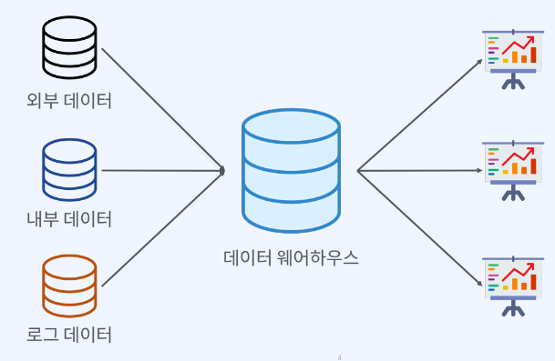

# 데이터 파이프라인
## 파이프라인?
하나의 데이터 처리 단계의 출력이 다음 단계의 입력으로 이어지는 형태로 연결된 구조

> 데이터 파이프라인

다양한 소스에서 데이터를 변환하고 옮기는 일련의 과정을 구성한 시스템  
Source > Processing > Destination

> 데이터 파이프라인은 왜 필요한가?
- 데이터 기반 의사결정 : 비스니스 데이터 분석, 리포팅
- 데이터 기반 애플리케이션 : 머신러닝, 데이터사이언스

> 누가 구축하는가?
- 데이터 엔지니어

> 어떻게 구축하는가?
- 빅테이터 아키텍처(= 설계도)를 기준으로 요구사항에 맞춰 파이프라인을 구축한다.

## 데이터 파이프라인 패턴
> 데이터 분석  

</img>

> ETL

Extract (추출) | Transform (변환)| Load (적재)
|----------|--------|------|
|데이터소스, 베이스로부터 데이터를 가져온다|데이터의 구조를 변경하는 프로세스(필터링, 가공)|변환된 데이터를 최종목적지에 저장한다|

>ELT 
: "최근 데이터 파이프라인의 트랜드"  "구성원의 책임을 분활하기 좋다"

Extract (추출) | Load(적재) | Transform (변환)
|--------|--------|-------|
추출과 적재를 하여 |------>>| sql을 사용해서 데이터를 변환하는 과정

> DataLake
- 원래 형태화 포맷을 이용해서 저장한다.  
  >DataLake에 저장된 데이터를 계층별로 나눈것  
1단계 : 원본 데이터 저장  
2단계 : 분석용 데이터(원본데이터를 가지고 분석에 필요한 데이터를 생성)  
3단계 : 피처데이터(ML,AI) / 집계데이터  
(머신러닝,AI에서 활용할 데이터를 저장한다.)  

> DataLake vs DataWarehouse

DataLake|DataWarehouse
|--------|-----------|
|원시데이터를 저장|구조화된 데이터 모델로 변경해서 저장(저장되기전에 미리 쿼리가 되어야한다)|

