# HDFS JAVA API 실습 (1)
## 1. hadoop 클러스터 구동
- hdfs namenode -format  
cd sbin  
start-dfs.cmd  
start-yarn.cmd 

** jps : jps명령어는 실행중인 JVM(Java virtual Machine) 프로세스 상태를 보여주는 것  
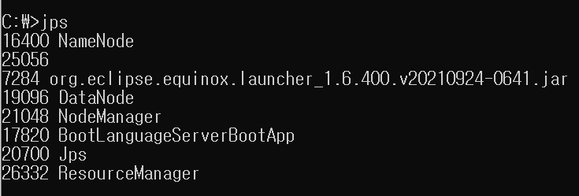

## 2. maven 설치
    - apache-maven-3.8.6
    -  maven home 환경변수 설정 

## 3. mvn package 실행  

    1. hdfs-example에 있는 폼파일을 hdfs에 업로드하기
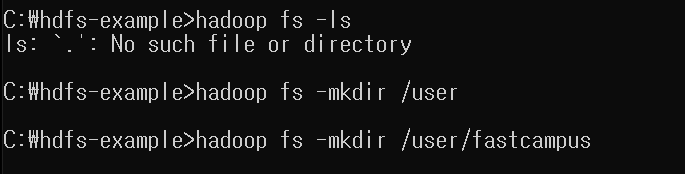

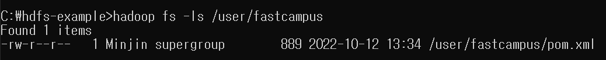

    2. 업로드한 폼파일을 vscode에서 실행해서 출력하기

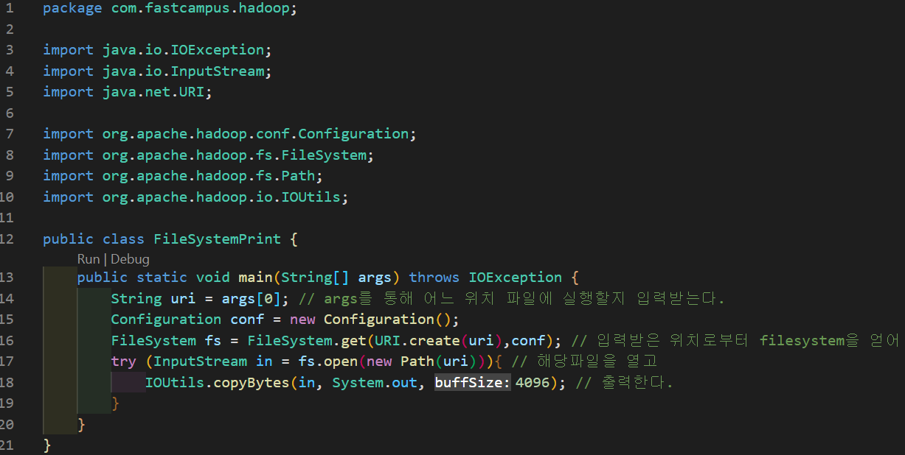

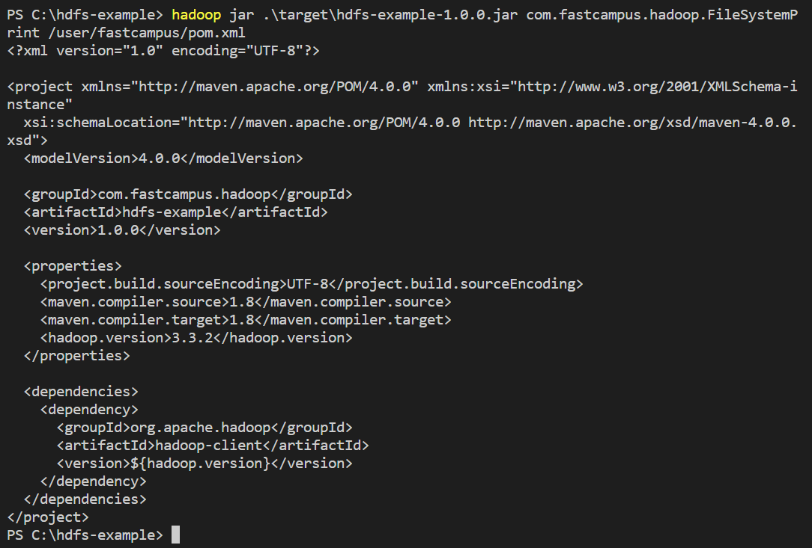

*hadoop jar 명령어를 이용하여 실행(타켓에 hdfs 자르파일 입력 + 실행할 메인 클래스위치를 지정 + hdfs에 위치하는 args를 넣고 실행) => 하둡파일시스템으로부터 읽어서 출력*   

# HDFS JAVA API 실습 (2)
## 디렉토리 목록을 조회

    1. 빌드  
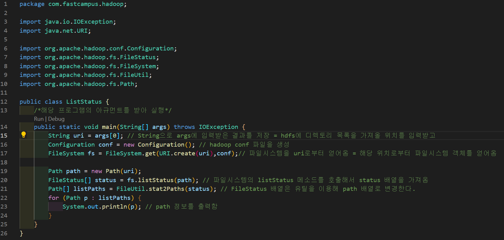
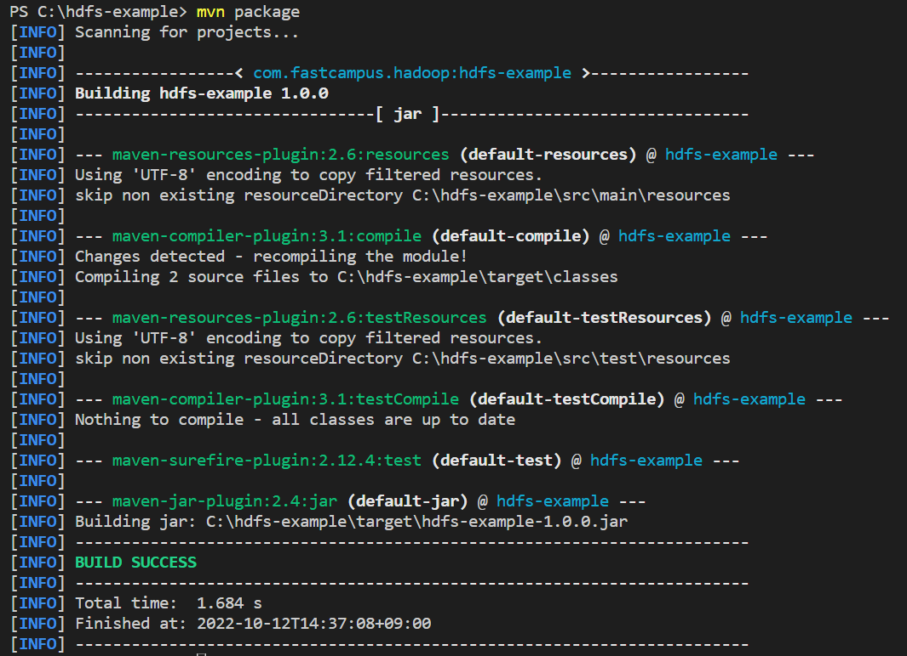

    2. 실행
*hadoop jar 명령어를 이용해 실행 + com.fastcampus.hadoop.ListStatus (실행할 메인함수와 위치를 알려줌) + 인풋아규먼트로 /user/fastcampus 위치의 리스트 목록을 받아옴*

## 로컬에 있는 파일을 hdfs에 복사
*= CLI로 CopyFromLocal, Put 명령어와 같음*

    1. 빌드
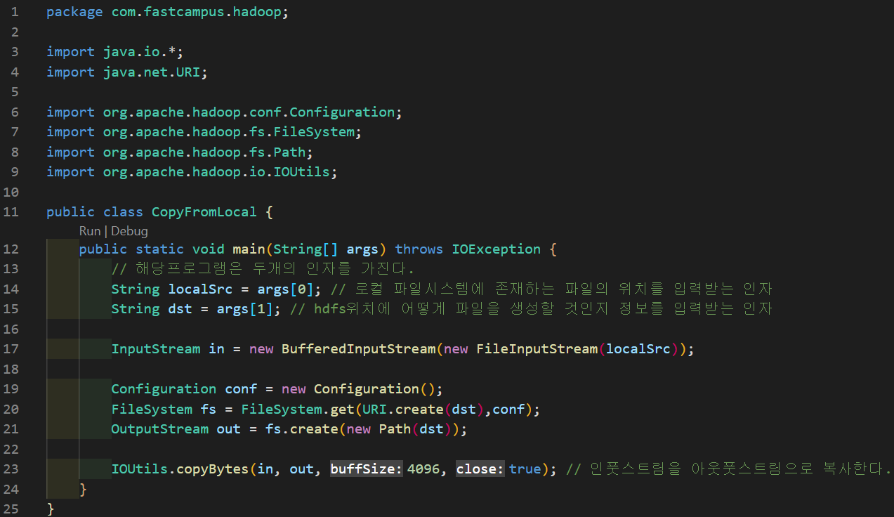
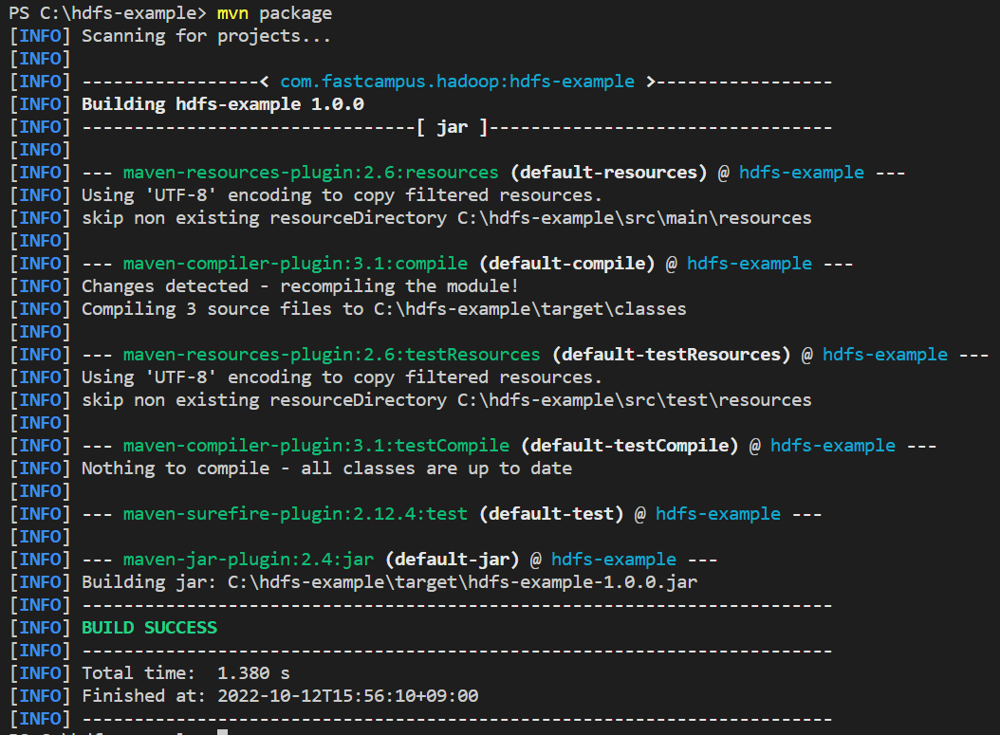

    2. 실행 
*파일 뭐있는지 확인하고 삭제*  

*hadoop jar 명령어를 이용 / 실행할 메인 함수가 있는 클래스 지정 / [첫번째 인자 소스를 주고] + [두번째 인자 user/fastcampus/pom.xml (pom.xml을 복사하겠다! 복사할 파일명까지 작성)]*

*해당파일이 제대로 복사가 되었는지 확인 cat*  

## 로컬에 있는 파일삭제

    1. 빌드
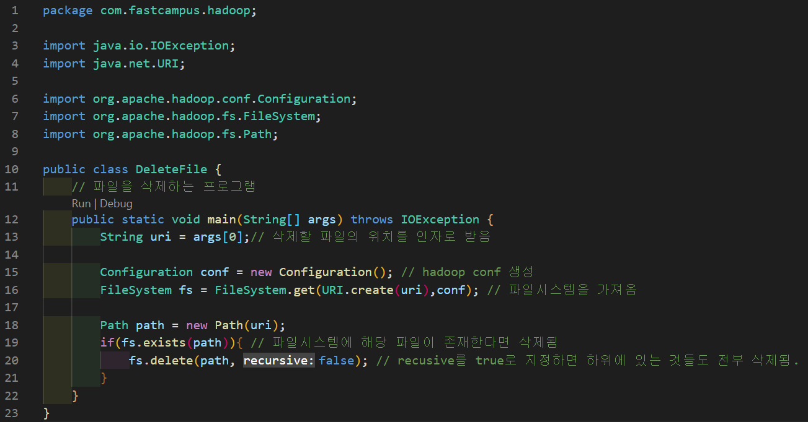
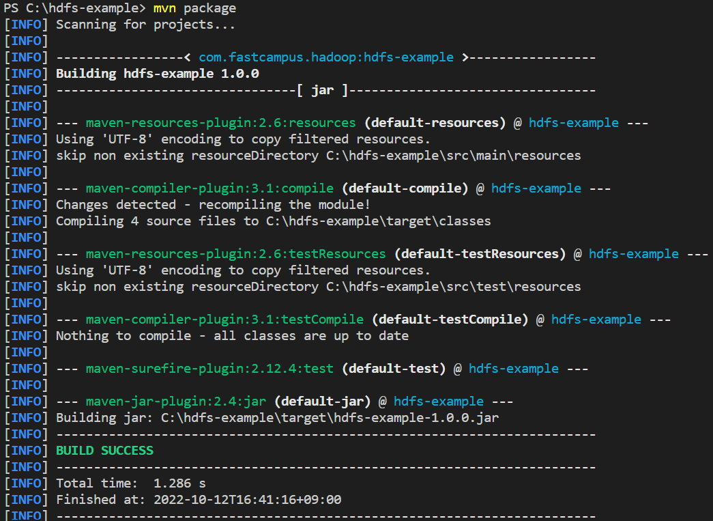

    2. 실행 
*hadoop jar 명령어를 이용 / 실행할 메인 함수가 있는 클래스 지정 / [첫번째 인자 소스 : 삭제할 파일 위치와 파일]*  
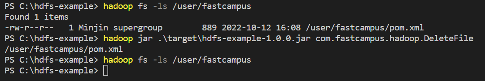

