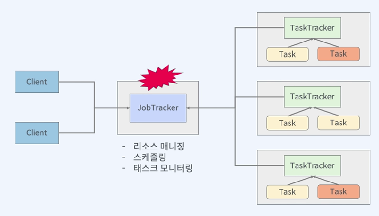
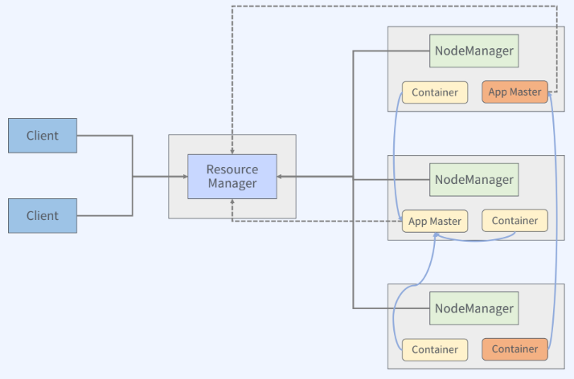

# YARN
- Yet Another Resource Negotiator : "또 다른 리소스 협상가"
- MapReduce 1의 문제점을 해결하기위해 등장  
  
*JobTracker=MasterNode, TaskTracker=WorkerNode*  
*JobTracker의 역할이 과중되어있다.*  

> ## YARN 특징
- JobTracker의 두가지 중요한 부분의 책임 분리
  - ResourceManager
  - ApplicationMaster
- 확장성 개선
- 다양한 워크로드 지원
- 클러스터 이용률 개선
- 기존 맵리듀스 호환성 지원  
  
*Mapreduce 외에 다른 프로그램 사용가능*  

>## YARN Architecture
---  
  

-  ResourceManager
    - 모든 클러스터 리소스를 중재하는 마스터
    - 주요 컴포넌트 : Scheduler(FIFO, Capacity,Fair), Applications Manager

-  NodeManager
    - ResourceManager가 NodeManager에 할당된 ApplicationContainer를 관리

-  ApplicationMaster
    - ResourceManager와 자원을 협상하고, NodeManager와 함께 동작하여 태스크를 실행하고 모니터링하는 역할

-  Container
    - 물리적인 resource의 단위, 하나의 노드에 여러 컨테이너가 존재할 수 있다.

>## MapReduce1 vs Yarn 컴포넌트 비교
MapReduce1 | Yarn |
|------|-------|
JobTracker|ResourceManager, ApplicationMaster, TimelineServer
TaskTracker|NodeManager
Slot|Container

>## YARN 동작 방식  
---
  

1. 클라이언트로부터 JobApplication의 제출이 요청됨
2. ResourceManager의 ApplicationManager가 받아서 최초의 ApplicationMaster를 위한 컨테이너 할당을 요청한다.
3. ApplicationMaster는 Application을 실행하기위한 컨테이너를 스케줄러에게 요청한다.
4. 스케줄러는 Application 실행을 스케줄링하면서 노드의 자원의 상태에 따라 컨테이너를 할당함

