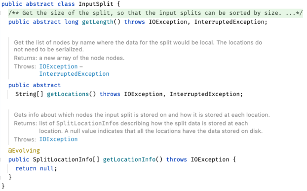

# MapReduce 
> MapReduce란?
- 구글에서 발표한 대규모 클러스터 환경에서 동작하는 분산 데이터 처리 알고리즘
- Hadoop에서의 MapReduce는 이를 자바로 구현한 애플리케이션이다.

> MapReduce 용어
- Job : 클라이언트가 실행하는 작업의 단위
- 각 테스크는 yarn(ResourceManager)를 통해 스케줄링 되고 실행이 된다.
  - Map task
  - Reduce task
- InputSplit : Mapper에 입력으로 들어오는 데이터를 분활하는 방식을 제공한다.

> MapReduce 처리과정 

  

 1. 파일로부터 Input을 입력받는다.     
 2. 입력파일들이 Split되어서 Map함수에 전달된다.     
 3. Map의 처리결과가 shuffle 과정을 통해 Reduce함수에 입력으로 전달된다.    
 4. Reduce함수의 처리결과가 Output   

---
  

*Combiner : Map의 결과를 기준으로 Reducer에 전달하기전에 미리 Map의 Output을 처리하는 방법을 제공해준다. shuffle하는 데이터의 양을 줄일 수 있다.* == Local Reducer  

    InputFormat

입력 파일이 분할 되는 방식(InputSplit), 읽는 방식(RecordReader)  

    InputSplit

맵의 입력으로 들어가는 데이터를 분할하는 방식 정의  
데이터의 위치와 읽어들이는 데이터의 길이를 정의하고 있다.

    RecordReader  
Split으로부터 데이터를 실제로 읽어들이는 역할 = 반복자  

    Mapper  

실제로 사용자가 구현한 비즈니스로직이 처리되는 곳

    Partitioner  

같은 키를 갖는 데이터는 물리적으로 동일한 Reducer로 전달해준다.  

    Shuffling and Sorting
전달받은 키를 기준으로 정렬을 수행하여  Reducer로 전달한다.

    Reducer

키 별로 정렬된 데이터를 가지고 사용자가 정의한 작업을 수행한다. 
 

> MapReduce 작동방식

  

1. Job 제출 

- 사용자가 MapReduce프로그램에서 Job을 생성해서 Submit 메소드를 호출한다.
- Job은 ResourceManager에게 ApplicationId를 요청한다.(Job의 출력명세를 확인하고 InputSplit을 계산한다.)
- Job울 실행하기위한 jar파일이나 환경설정파일 등과 관련된 리소스를 분산파일시스템에 복사한 후 다시 ResourceManager에게 SubmitApplication 메소드를 호출하여 Job을 제출한다.

 2. Job 초기화  

- ResourceManager에서 Application의 제출을 받게되면 스케줄러에게 요청을 전달하고, 스케줄러는 컨테이너를 할당함
- ApplicationMaster 프로세스 실행
- ApplicationMaster는 Job의 진행상태를 추적하기위한 다수의 객체를 생성한다.
- 각 태스크로부터 진행상황과 종료리포트를 받기위한 Job 초기화작업을 진행한다.
- 클라이언트에서 계산한 InputSplit정보를 분산처리시스템으로부터 읽어들인다.

 3. Task 할당 

- ApplicationMaster에서 ResourceManager에게 Job의 모든 Map과 ReduceTask를 실행하기위한 컨데이터를 요청한다.

 4. Task 실행 

- ResourceManager의 스케줄러가 특정노드상의 컨테이너를 위한 리소스를 Task에 할당한다.
- ApplicationMaster는 nodemanager와 통신하여 컨데이너를 실행한다.

 5. 진행상황과 업데이트   

- Map과 ReduceTask를 실행하게 되면서 ApplicationMaster와 밀접한 인터페이스를 통해 계속 통신한다.

 6. MapReduce Job 완료   
- 마지막 태스크가 완료되면 AM이 Job 상태를 성공으로 변경
- 클라이언트에서 실행한 waitforComletion 메서드가 반환
- Job 통계와 카운터와 같은 메시지를 출력
- 히스토리 서버에 잡 정보 기록