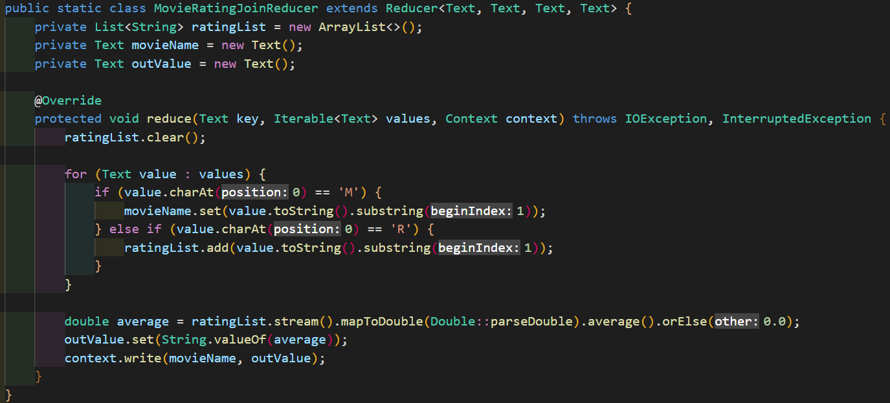
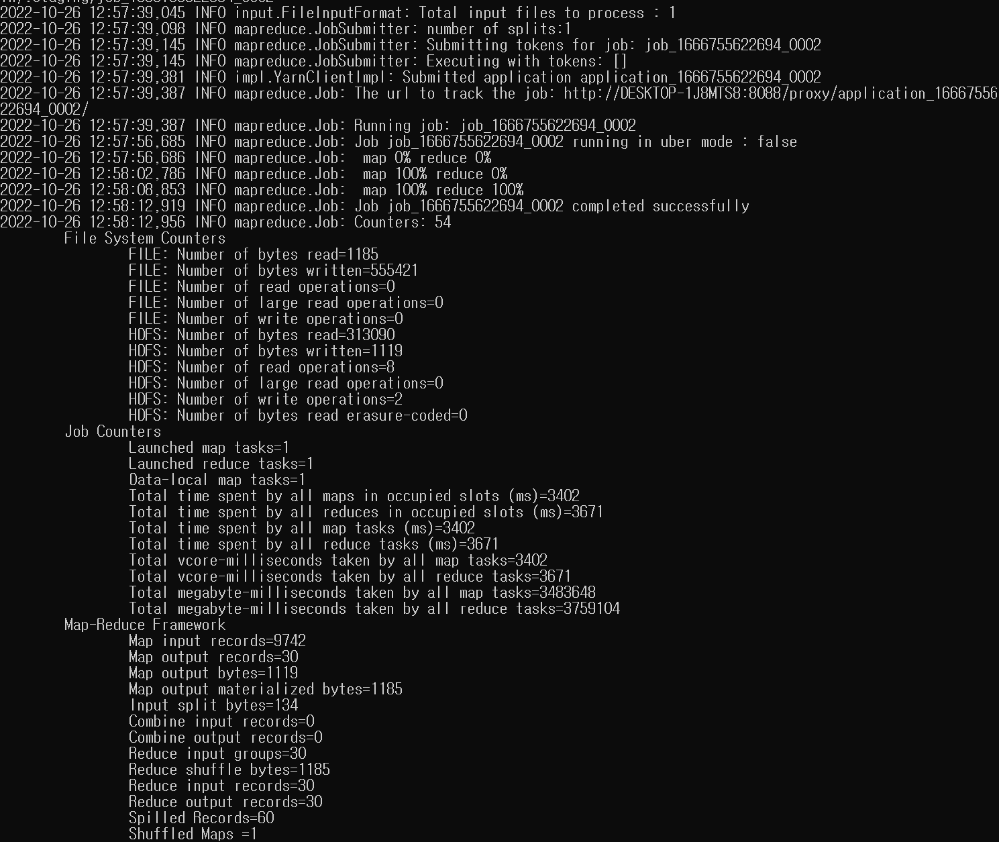

# 영화 평점 Top 30 프로젝트

## 1) MapReduce - join  
- 영화 제목과 평균평점 구하기  
</img>  
        - *'M' 키워드를 입력받아서 영화제목을 입력받고, 'R' 키워드를 입력받아서 평점을 입력받는다.*  
        - *ratingList : 영화의 평점정보*  
        - *double average : 평점정보를 이용해 평균을 계산하여 저장한다.*  
        - *출력 데이터의 key값은 영화제목, value 값은 평점평균*

## 2) MapReduce - Sorting  
- 영화 제목과 평균평점 구한 것을 정렬하여 상위 30위를 구하기  
</img>  
        - *위에서 출력데이터 key값과 value값을 입력받는다. 자바에서 제공하는 TreeMap을 이용하여 정렬*  
        - *if문에서 평점평균이 높아서 30개이상이 되면 가장 낮은 평점인 데이터를 삭제한다*

## 3) 실행결과     
1. 하둡 클러스터 작동
2. 무비 디렉터리 input 파일에 생성하기위해 디렉터리 만들기  
</img>  
3. 데이터셋 업로드   
</img>  

4. 빌드 진행
    1. 메이븐 페키지명령
    2. job1,2 실행
    </img>    

5. 결과확인
    1. 첫번째 맵리듀스 잡의 결과 확인  
    </img>  
    </img>  

    2. 두번째 맵리듀스 잡의 결과 확인  
    </img>    
    </img>

    3. job1 = 영화 제목과 평균평점  
    </img>

    4. job2 = 상위 30위 영화제목과 평균평점  
    </img>  

