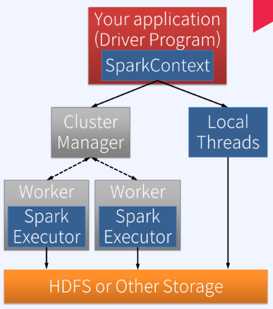

# Apache Spark

> Apache Spark 란?
- 빅데이터에 대한 컴퓨팅 연산을 다수의 서버로 구성된 클러스터에서 분산병렬처리하기 위한 오픈소스 엔진  
- 저장소가 아니다. 외부의 데이터를 읽어 분산환경에서 원하는 형태로 데이터를 처리한 후 그 결과를 다시 외부에 저장을 한 컴퓨팅 엔진이다.  
- 보다 빠른 연산을 위해 클러스터 내에 여러 노드의 메모리에 반복 조회가 필요한 데이터를 캐시하는 기능 제공  
- 배치, 대화형 쿼리, 스트리밍, 머신러닝과 같은 다양한 작업 타입을 지원하는 범용 엔진으로 Apache Hadoop과 호환
- Scala, Java, Python, R기반 High-level APIs 제공

> Apache Spark 특징
- In - Memory 컴퓨팅
- RDD (Resilient Distributed Dataset) 데이터 모델
- 다양한 개발 언어 지원
- Rich APIs 제공
- General execution Graph => DAG (Directed Acyclic Graph) => Multiple stages of map & reduce
- Hadoop과의 유연한 연계(Hdfs, HBase, YARN etc)
- 대화형 질의를 위한 Interactive Shell
- 실시간 Stream Processing (vs. MapReduce for stored data)
- 하나의 Spark 애플리케이션에서 배치, SQL 쿼리, 스트리밍, 머신러닝과 같은 다양한 작업을 하나의 워크플로우로 결합 가능

> Spark의 핵심 데이터 모델 RDD 
- DataSet : 메모리나 디스크에 분산 저장된 변경 불가능한 데이터 객체들의 모음
- Distributed : RDD에 있는 데이터는 클러스터에 자동 분배 및 병렬 연산 수행  
- Resilient : 클러스터의 한 노드가 실패하더라도 다른 노드가 작업 처리 (RDD Lineage, Automatically rebuilt on failure)  

> RDD 특징
- Immutable : RDD는 수정이 안됨. 변형을 통안 새로운 RDD 생성  
- Operation APIs 2가지

|Transformations API|Actions API|
|-------|-------|
|RDD내의 데이터 변형하는 API, e.g. map, filter, groupBy, join|RDD내의 결과연산 리턴/외부에 저장하는 API, e.g. count, collect, save|
|변형된 새로운 데이터로 구성된 RDD를 리턴한다.|RDD내의 실제 데이터를 드라이버 프로그램으로 가져오거나 외부 저장소에 결과를 저장한다.|

- Lazy Evaluation : All Transformations (Action 실행 때까지)
- Controllable Persistence : Cache in RAM/Disk 가능(반복 연산에 유리)

## RDD 생성 > RDD 변형 > RDD 연산
---

1. 외부 데이터를 (분산병렬로) 읽어 RDD에 담는다.
2. 원하는 형태의 데이터가 될 때까지 RDD Transformations을 반복 수행한다. (= 바뀌어진 새로운 RDD를 생성)
3. 최종 RDD에 원하는 Action을 수행한다.
    - 데이터가 몇 건이 있는지 볼 수 있다.
    - 원하는 데이터를 배열로 가져올 수 있다.
    - 외부 저장소에 저장한다.

> Web Notebook  

기본적으로 대화형분석이 가능, 작성한 코드를 저장, 노트북자체의 차트기능을 통해 분석한 내용에 대해 시각화 가능
- Apache Zepplin : 하나의 노트에서 여러 클러스터의 접근이 가능, 하나의 노트에서 여러 언어로 스파크 코드 작성이 가능
- Jupyter Notebook : 주로 Python 기반 웹 노트북으로 사용, 스파크 연동시 노트 하나가 하나의 스파크 어플리케이션이 된다.
- RStudio Server : 설치형 RStudio 환경을 웹브라우저에서도 경험할 수 있게해주는 웹기반 노트북 환경을 제공

> Administrative Web UIs( 관리형 웹 UI)

- Driver( = Spark Application UI) : 코드를 작성해 실행하게되는 Spark Application 자체가 제공하는 Web UI
  - 실행되는 동안 다양한 정보를 보여주는 대시보드 역할, Spark이 수행하는 각 작업의 스케줄링 정보와 메모리와 같은 리소스 사용량, 각종 환경정보와 분산환경에서 구동중인 실행정보를 확인할 수 있다. 
  - http://<Driver Node> : 4040 (default)

- History Server : Spark Application 종료 후에도 관리형 UI를 볼 수 있도록 별도의 UI를 제공
    - .inprogress로 끝나는 eventlog는 아직 실행중이거나 비정상종료된 것을 나타냄

- Cluster Manager(Cluster Resource Manager) : Spark Standalone, Hadoop Yarn과 같은 클러스터 매니저 자체가 제공하는 Web UI
    - Spark Standalone Web UI : URL로 클러스터 매니저와 통신

> Spark Software Components

</img>  
- Spark Driver : Spark 프로그램의 시작점인 SparkContext를 내부에 생성하고 유지한다. 
- Spark Context : 작성한 메인 프로그램 자체는 Driver process로 실행, 작성한 메인 프로그램 코드 내의 주요 데이터 처리 코드는 Excecutor process에서 Task 형태로 실행  
    - *하나의 Driver 프로그램과 복수 개의 Excecutor들로 구성되어 실행된다.* 
    - *가까운 Excecutor들은 Driver가 할당한 Task들을 병렬로 실행하고, 그 결과를 Driver에게 전달한다.* 
    - *Local 환경에서 실행하면 Excecutor 프로그램은 별도로 실행되지않고, Driver 프로그램의 프로세스 내에서 Local Treads 실행된다.*
    - *분산환경에서 실행하면 Excecutor 프로그램은 클러스터 매니저가 할당해준 서버들 위에서 각각 별도의 프로세스로 실행된다.*

## Submitting Application on Cluster
        Spark Application을 Local 환경이 아닌 Cluster 환경으로 전달한 경우  

</img>  

1. 드라이버 프로그램 내의 SparkContext가 사용자가 지정한 Cluster Manager에 연결하여 Excecutor 생성을 요청한다.
2. Cluster Manager는 사용자가 지정한 만큼의 CPU core와 메모리크기를 할당하여 클러스터 내의 적절한 노드 위에서 사용자가 요청한 갯수 만큼의 Excecutor 프로세스를 생성한다.
3. 생성된 Excecutor들은 Driver Program에게 접근하여 통신을 가능하게 한다. 이 후 Driver Program은 할당받은 Excecutor들과 통신하며, 각 Excecutor가 수행할 Task들을 스케줄링하고 각 Excecutor에게 적절한 Task들을 전달하고 그 실행결과를 전달받는다.

