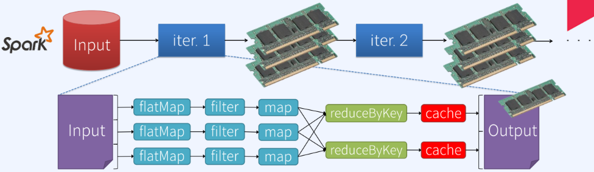

# Spark vs. MapReduce
|Spark|MapReduce|
|---|---|
|</img>|</img>|
|Apache Spark에서 제공하는 flatMap, filter, map reduceByKey 와 같은 다양한 상위레벨 API들을 연속적으로 사용하여 원하는 만큼 연산 처리 가능하다.|hdfs에서 데이터를 읽어 연산 처리 후, 그 결과를 다시 hdfs에 기록한다. 데이터 연산은 Map과 Reduce 두 개의 스테이지로 구분되어 처리된다.(필요한 데이터처리를 위해 두 개의 스테이지 작업 반복) 데이터 처리 결과를 hdfs에 write 할 때 데이터는 복제되고 직렬화되며 기본적인 disk IO가 발생하기 때문에 다소 느린편.|
|반복적으로 사용하게 될 데이터를 캐시하여 디스크보다 빠르게 재사용할 수 있다.|머신러닝, 그래프와 네트워크 분석과 같은 반복적인 연산을 필요로 하는 알고리즘을 처리하는데 있어서 다소 비효율적.|
|간결한 코드 작성만으로 원하는 데이터처리를 보다 쉽게 작성가능. |데이터에 대해 쿼리를 바꿔가며 다양한 질의를 실행하여 데이터를 분석하는 대화형 데이터 마이닝 작업에 비효율적.|

