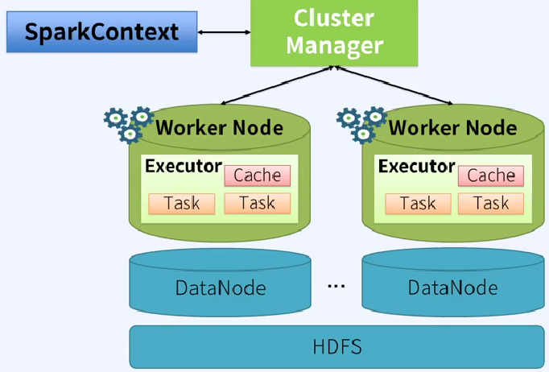
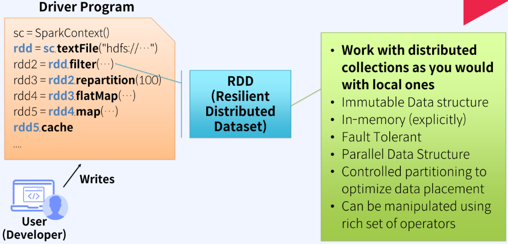
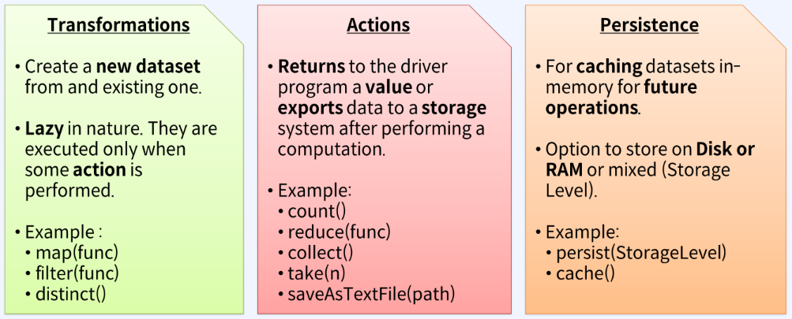

# Apache Spark Programming Model

> Spark Context

*Spark program의 작성은 Spark Context로부터 시작된다.*

</img>
- Spark Context는 Cluster Manager에게 Excecutor 생성을 요청한다.  
*실제 데이터를 읽고 처리, 저장하는 것은 Excecutor의 Task를 통해 이루어진다.*

> RDD

</img>  
- spark context를 통해 대용량 데이터를 담는 RDD를 생성한다.
- RDD에 담겨진 데이터는 Partition 단위로 분리되어 다수의 Excecutor에 분산되어 존재한다.
- 이 후 RDD가 제어하는 API를 통해 RDD에 담겨진 데이터에 대한 다양한 변경 작업을 함수형 코드로 작성한다.  
*RDD에 담겨진 데이터에 대한 다양한 변경하는 API : Transformation API*

- Transformation API를 실행하면 변경된 데이터를 담고 있는 새로운 RDD를 리턴한다.
*기존 RDD에 담겨진 데이터를 직접 변경x ==> Immutable Data 구조*

- 데이터에 대한 처리 작업 코드는 Excecutor에 전달되어 분산병렬로 실행된다.  
*기본적으로 RDD에 담겨진 데이터 처리는 하나의 partition에 대해 하나의 Thread가 동작한다.*

- action API는 실행될 때마다 외부에서 데이터를 새로 읽어와 최초의 RDD부터 다시 생성하여 순차적으로 작업을 처리한다.  
*RDD에 담겨진 데이터를 Driver로 가져오거나 외부저장소에 저장하기위한 API : action API*

- RDD에 대한 변경 작업 중 반복적으로 자주 사용될 것 같은 RDD는 성능향상을 위해 메모리나 디스크에 *Cache* 한다. ==> Cache 된 RDD에서 부터 처리하게 되어 처리 속도 측면에서 성능 향상

> RDD가 제공하는 APIs

</img>  
**action API를 호출해야만 transformation 작업들을 순차적으로 실행한다. ==> 실행최적화*  

**action API는 변경된 RDD 데이터결과에 대한 최종 처리 작업을 담당*

**Persistence API는 향후 반복적으로 사용될 것 같은 RDD를 메모리나 디스크에 Cache 함*

