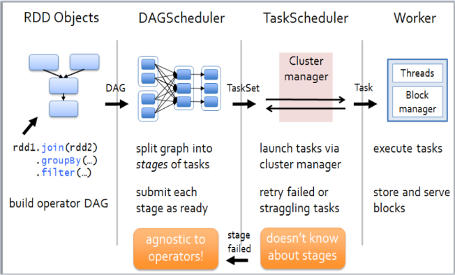
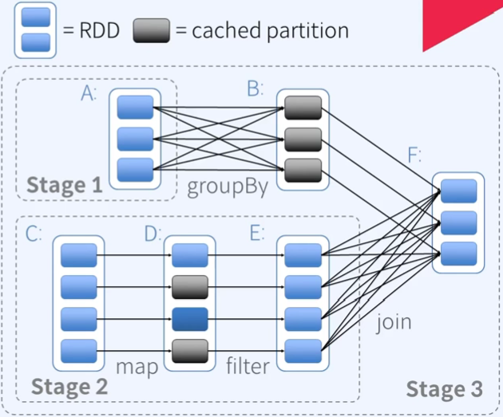
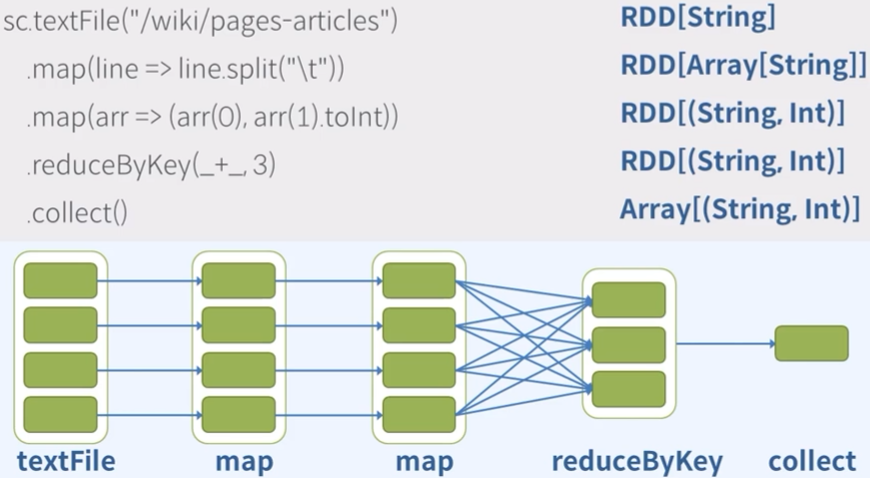
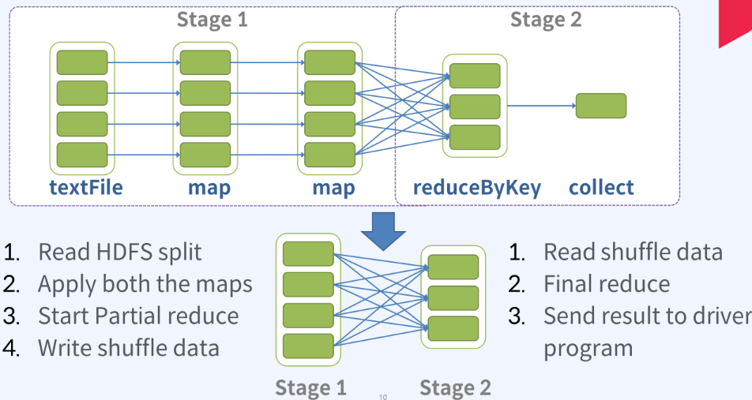

</img>  
- RDD를 생성, 변환, 액션을 실행
- DAG(Directed Acyclic Graph) 생성
    - DAG는 실행을 위해 단계별 스테이지(Task로 구성)로 분할된다. 
- RDD 한개에 Task 한개가 할당된다.
- Stage를 구성하는 Task들은 분산병렬실행을 위해 클러스터에 제출된다.
- worker에 있는 excutor process는 전달받은 Stage의 Task들을 실행한다.

---
</img>   
- Task 수행을 위한 일종의 workflow 같은 그래프를 생성한다.
- RDD에 수행하는 여러 기능에 대해 자동으로 파이프라인으로 작업을 수행한다.
    ex) RDD에 있는 하나의 레코드에 대해 map, filter와 같은 기능을 순차적으로 적용하여 처리한다.
- 성능향상을 위해 되도록 가까운 곳에 있는 데이터 파티션에대해 Task를 수행하도록 할당을 조정한다.
---
</img>  
1. sc.textFile("/wiki/pages-articles") : sparkContext의 textFileAPI를 통해 textFile을 읽어 RDD를 만든다. (레코드 타입은 string) - 파일의 크기에 따라 partition 갯수가 정해짐

*TransformAPI*

2. .map(line => line.split("\t")) : RDD의 레코드를 구분자 탭으로 스플릿한다. string 타입의 값을 스플릿하면 Array가 생성된다. 
    - 새로운 생성된 RDD의 레코드 타입은 string의 Array

*map API : 실행시 다른 partition의 레코드는 신경쓰지 않는다. = 파티션 갯수의 변화가 없고, 파티션 간의 데이터 이동이 없다.*

3. .map(arr => (arr(0), arr(1).toInt)) : string Array 타입 RDD에서 인덱스 0과 1에 위치하는 값만 추출하여 튜플을 구성한다. 인덱스 1에 해당하는 값을 int로 변환한다. 
    - 새로운 생성된 RDD의 레코드 타입은 string과 int의 튜플

4. .reduceByKey(_+_,3) : 같은 key값을 가지는 튜플들을 한 곳에 모아 각 value의 값을 모두 더하는 reduce 연산
    - 튜플이 두개의 값으로 구성될 때 keyvaluepair라고 부른다. (= 앞의 값이 key, 뒤의 값이 value) 튜플의 key 별로 데이터를 그룹핑하여 같은 key 내의 value들에 대해 reduce 연산을 수행한다.
    - 파티션간 레코드 이동이 필요한 셔플이 발생한다.  

*ActionAPI*

5. collect() : RDD에 있는 모든 레코드들을 excute 해서 드라이버로 Array형태로 묶어서 가져온다. 

---
</img>  
- Spark는 위 코드를 해석하여 RDD에 대한 DAG를 생성한다.
- DAG는 셔플을 기준으로 스테이지를 분할한다. = 스테이지 내에는 셔플이 없다.

### 첫번째 스테이지(파이프라인1)
- hdfs에서 블록단위로 파일을 읽는다. 
- 두번의 맵 연산을 수행한다.
- 부분적인 파티션 내의 리듀스 연산을 수행한다.
- 셔플 데이터를 로컬디스크에 write 한다.

### 두번째 스테이지(파이프라인2)
- 이전 스테이지에서 write 한 셔플데이터를 읽는다.
- 최종 리듀스 연산을 수행한다.
- 결과를 드라이버로 보낸다.

