# Log Generator    
- 여러 사용자가 웹 페이지를 검색하여 사이트를 탐색하고있는 이력을 로그로 생성해주는 애플리케이션이다.   
- 쓰레드들이 하나의 사용자가 되어 웹의 활동 내역을 로그로 생성하여 Kafka에 전달한다.  

> Log 형식  

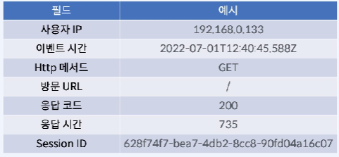</img>  

> Log Generator 구현  

1. Log Generator pom.xml  
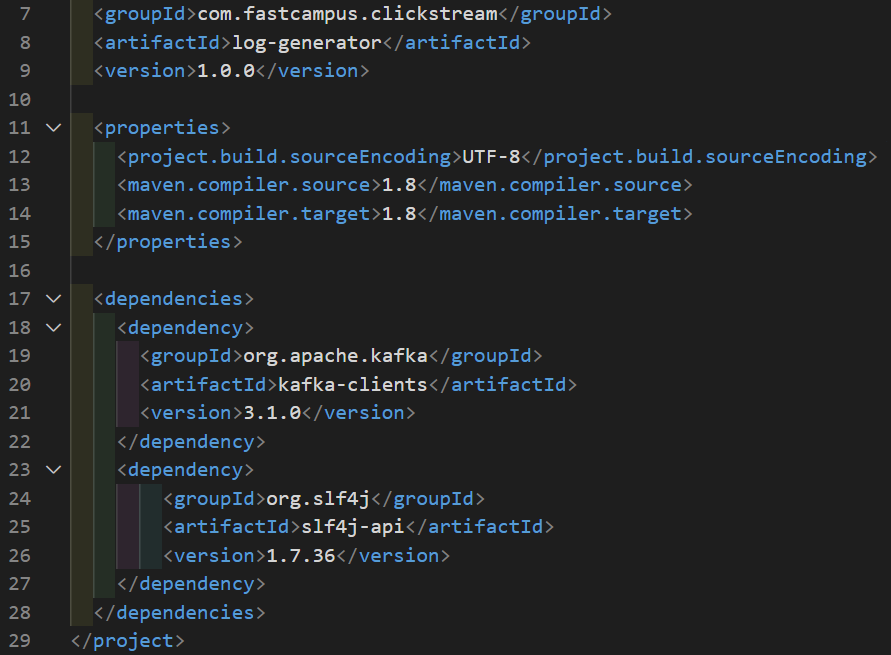</img>  

2. Main.java 작성  
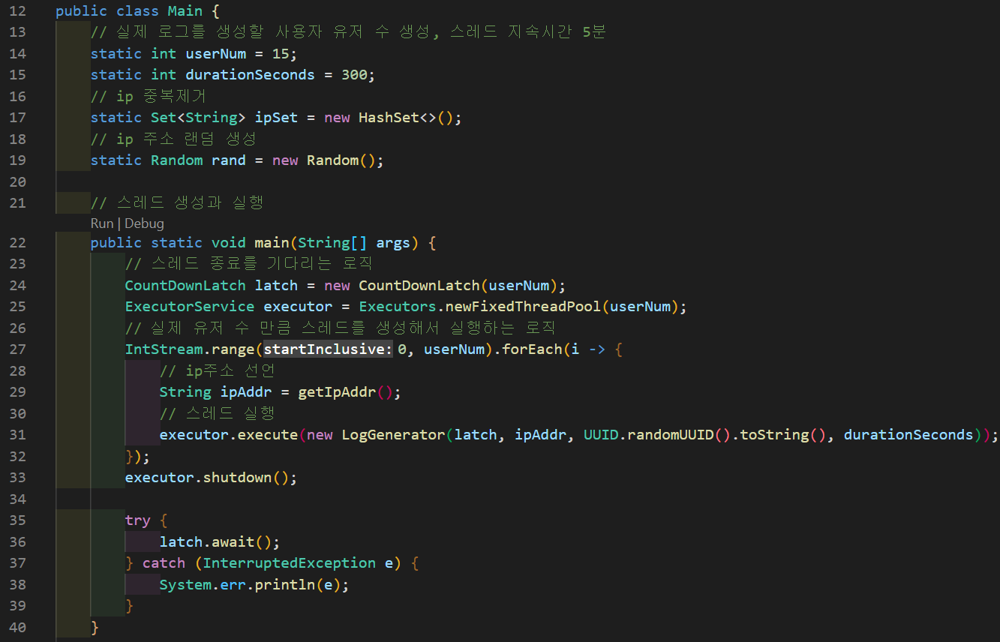</img>  
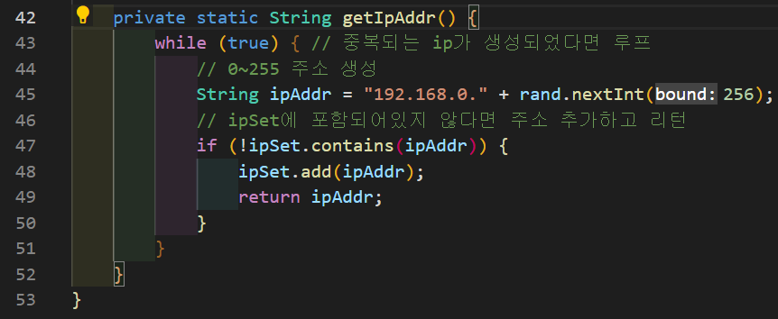</img>  

3. LogGenerator.java 작성  
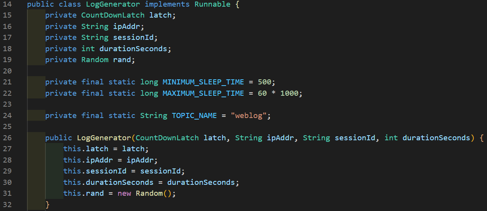</img>  
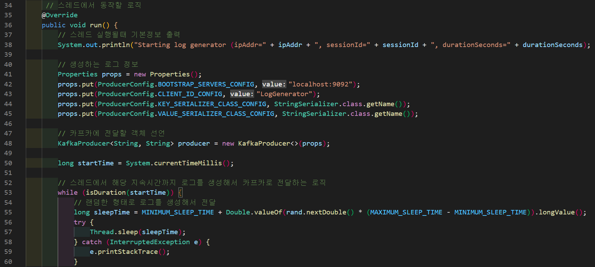</img>  
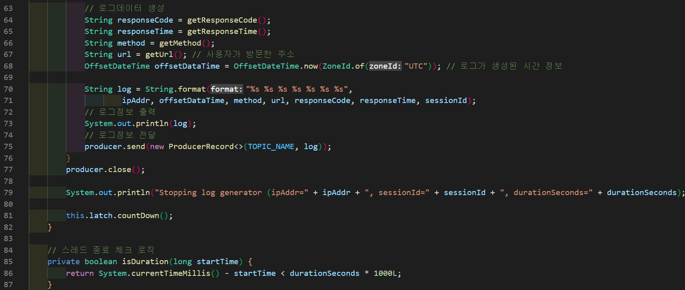</img>  
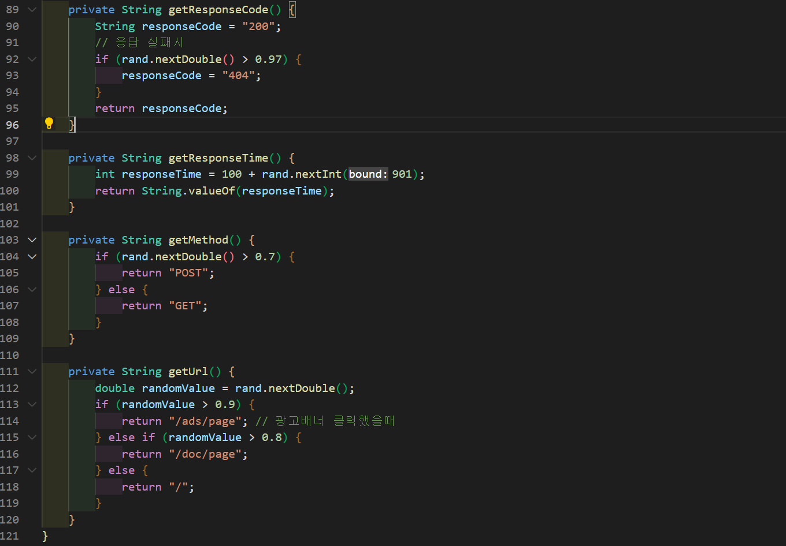</img>  

- *카프카에 전달하기위한 카프카 설정과 카프카 프로듀서 객체를 선언한다.*  
- *해당 쓰레드에서 동작하는 로직 == 사용자가 다른시간에 접속하고 활동하기때문에 최소시간 최대시간 사이에 로그데이터 생성한다.*  
- *해당 로그 정보를 카프카에 전달하는 로직을 구현*  

4. Docker Desktop 실행  

5. kafka 클러스터 구동 - docker-compose up  

6. kafdrop 실행 확인 *localhost:8080*  
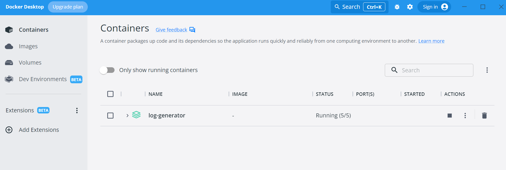</img>  
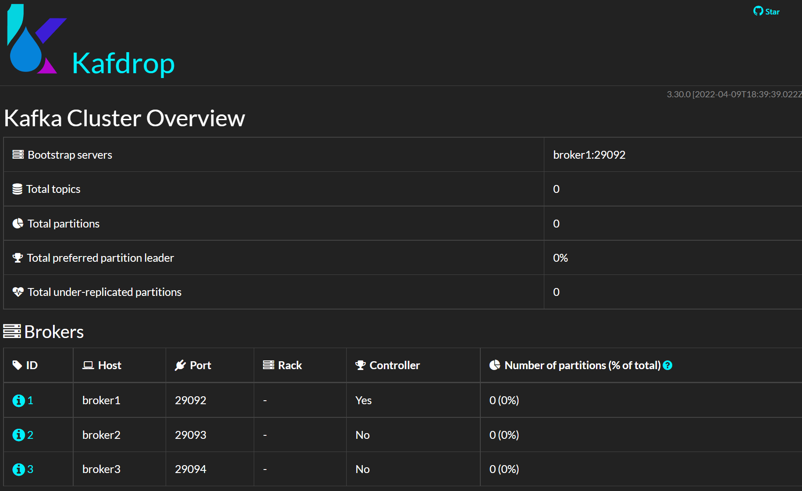</img>  

7. Log Generator에서 사용할 topic 생성  
</img>  
</img>  
</img>  

8. Log Generator 실행  
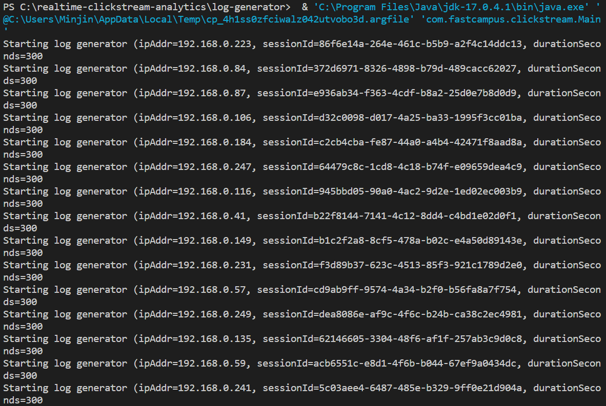</img>  
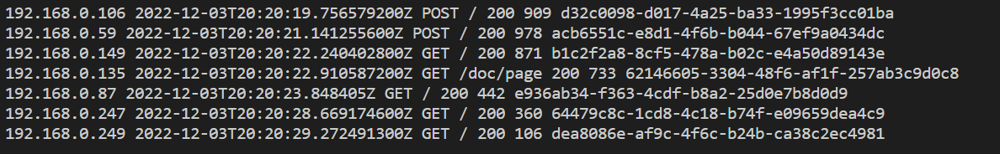</img>  
*ip주소/시간정보/http메서드/url정보/응답코드/응답하는데 걸리는시간/세션아이디*  출력  

9. kafdrop topic에 정상적으로 메시지가 보내지고 있는지 확인한다.  
</img>  

