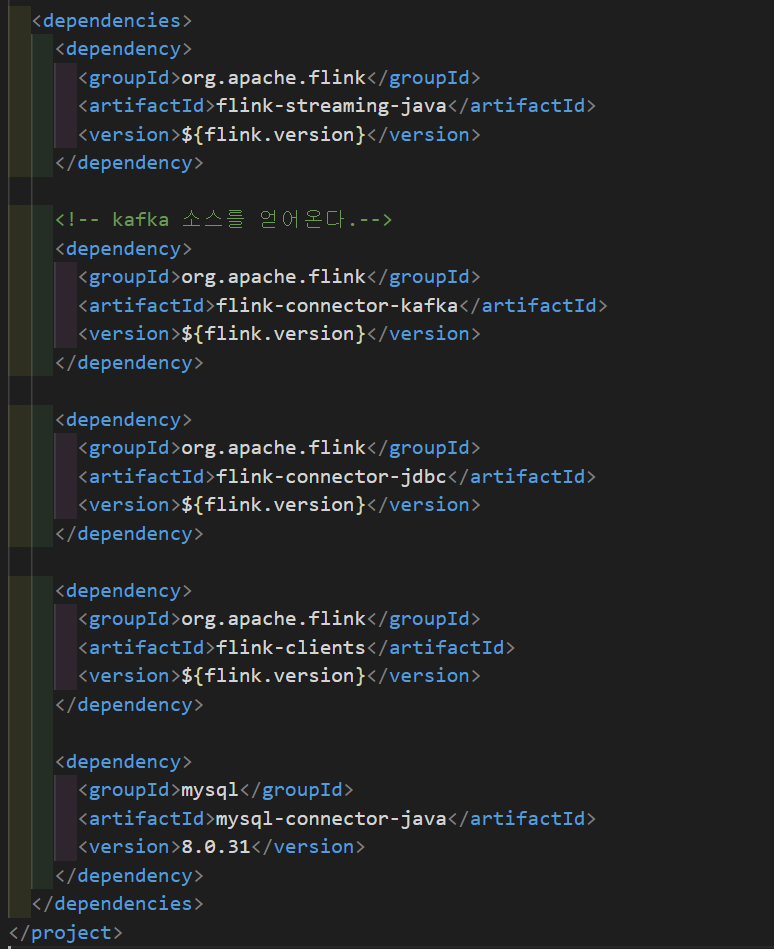
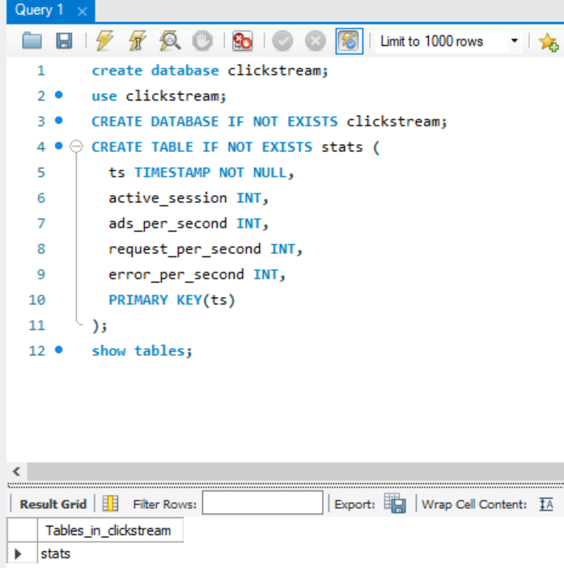
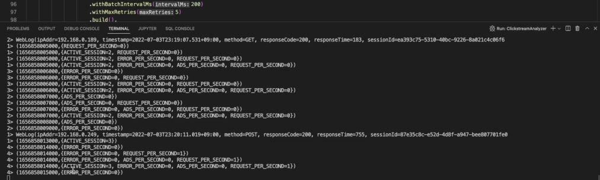
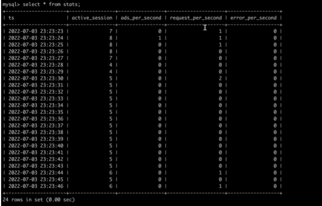
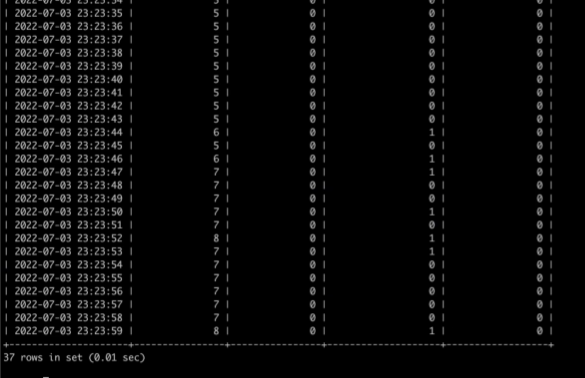

# ClickStream analyzer  
- 로그 정보를 기반으로 클릭스트림의 분석 결과를 생성하여 데이터베이스에 저장하는 애플리케이션이다.

> 실시간 ClickStream analyzer에서 생성하는 분석 통계 정보  
- 현재 활성 유저 정보  
- 초당 광고 배너(URL)클릭 횟수  
- 초당 서버요청 횟수  
- 초당 서버에서 에러 코드를 응답하는 발생 횟수  

> ClickStream analyzer 구현  

1. ClickStream-analyzer pom.xml  
</img>  
*본 프로젝트에서 사용할 디팬던시 파일들을 추가*  

2. mysql 설정  - 데이터를 최종적으로 저장할 테이블 생성  
</img>  

3. java 파일생성  

    - ClickStreamAnalyzer.java  
    - WebLog.java  

4. kafka 클러스터 실행/ kafdrop 구동  
    - topic 생성  
</img>
</img>  

1. Log Generator- main.java 실행 (run java) - kafka topic으로 데이터 저장  
</img>  

1. ClickStreamAnalyzer.java 실행  
</img>  
*세션정보 출력*  

1. 실제 데이터들이 mysql에 저장되고있는지 확인  
</img>  
</img>  

