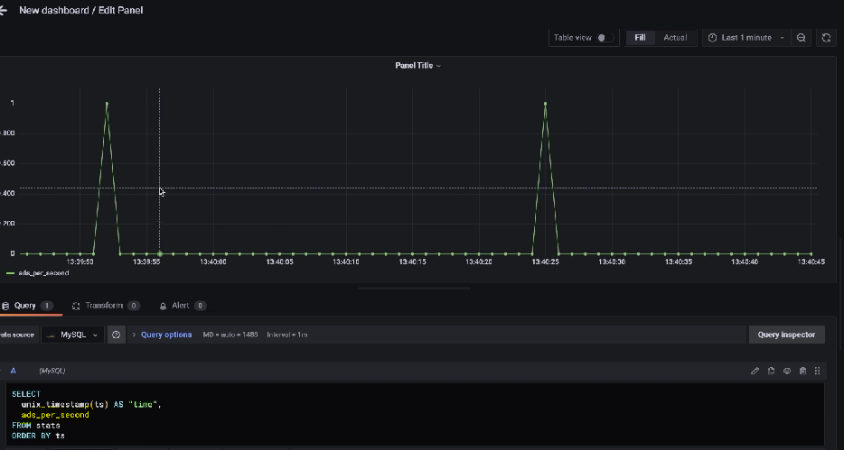

# 실시간 Dashboard  
- Grafana를 이용하여 실시간 클릭스트림 통계 정보를 통합하여 시각화한다.  
</img>  

> Grafana 실행  

</img>  
    - localhost:3000 접속  (초기 아이디, 비번 : admin)  
</img>  

1. Log Generator - main.java 실행 : 실제 로그들이 kafka topic으로 전송한다.
2. clickstream_clickstreamanalyzer자바실행 : 로그 정보를 kafka로부터 가져와서 분석결과를 처리해준다. 결과는 mysql DB에 저장된다.   
</img>  

3. Grafana에서 대쉬보드 생성
    - grafana 내에서 mysql에 있는 데이터베이스로부터 데이터를 가져오기위한 데이터소스를 생성한다.  
*Configration > Data source*  
</img>  
</img>  

    - 대쉬보드 생성  
*Dashboards > New dashboard*  
</img>  
    - *mysql로부터 데이터를 읽는 형대로 패널 구성한다. -->   *하단에 쿼리정보를 입력하여 저장**  
</img>  
</img>  
</img>  
</img>  

4. 패널 전체 확인  
</img>  

5. 실시간 스트림 패널 확인  
</img>  
</img>  

