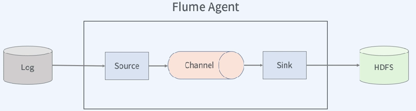
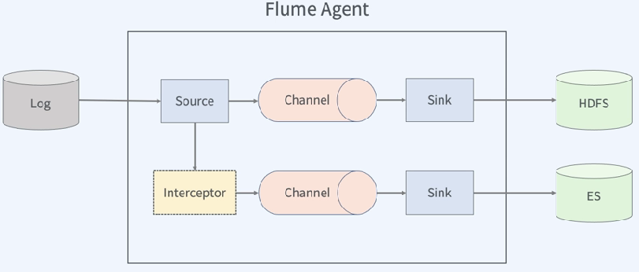
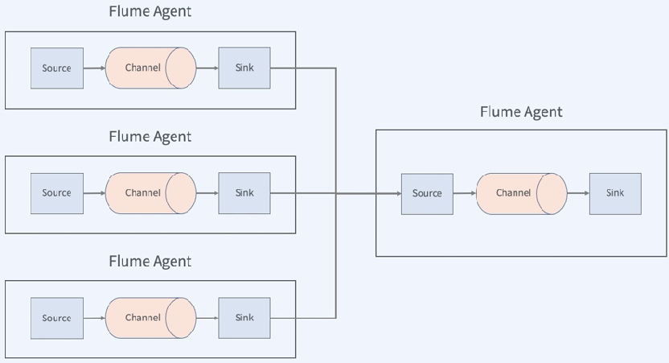

# Flume
### Log란?
- (컴퓨터 분야) 운영 체제나 다른 소프트웨어가 실행 중에 발생하는 이벤트나 각기 다른 사용자의 통신 소프트웨어 간의 메시지를 기록한 데이터
- *통나무* 

### Log flume  
- 통나무 수로 ( 통나무를 운반하는 수로 )  
</img>  

> 구성 요소
- Event
- Agent
  - Source
  - Intercepter
  - Channel
  - Sink

### Flume Agent 예시 1  
</img>  
로그로부터 이벤트를 소스로 입력받은 후, 소스에서 채널로 전달하고 채널로 전달된 데이터가 싱크로 전달되어 hdfs에 쓰여진다.  
*Agent에는 최소 Source, Channel, Sink 하나씩은 존재해야 함*  
*Source는 여러 Channel로 전달 가능함*  
*Sink는 오직 하나의 Channel에서만 데이터를 전달받을 수 있다.*  

### Flume Agent 예시 2 (하나의 소스로부터 2개의 Channel로 전달되는 예제)  
</img>  
하나의 Channel에서는 Intercepter를 통해서 데이터를 가공해서 전달, 각각의 Sink는 Hdfs와 ES에 출력한다.  

### Flume Agent 예시 3  (여러 flumeAgent로 구성된 예시)
</img>  
여러 소스로부터 수집된 데이터를 하나의 Flume Agent로 모아서 집계를 한 후, 저장할 수 있는 형태  

