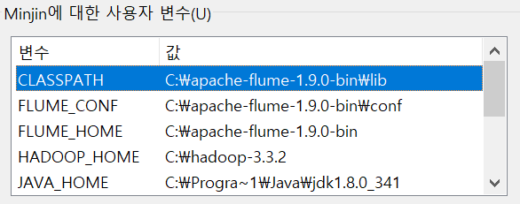
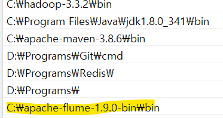
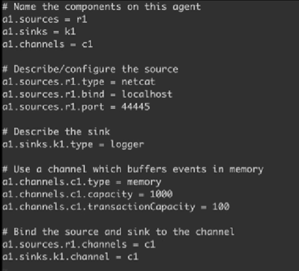
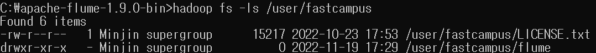
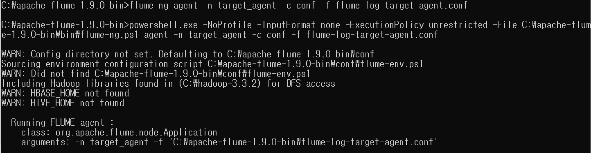
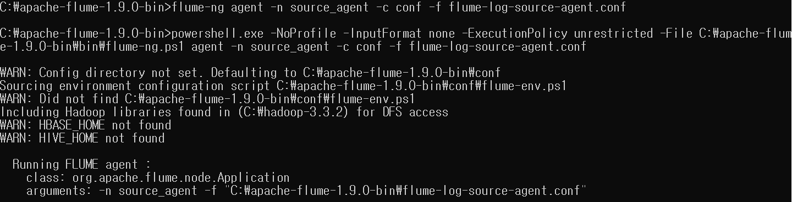
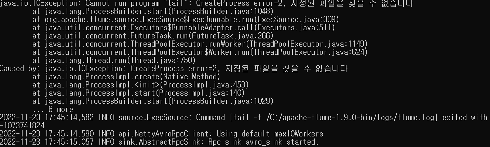
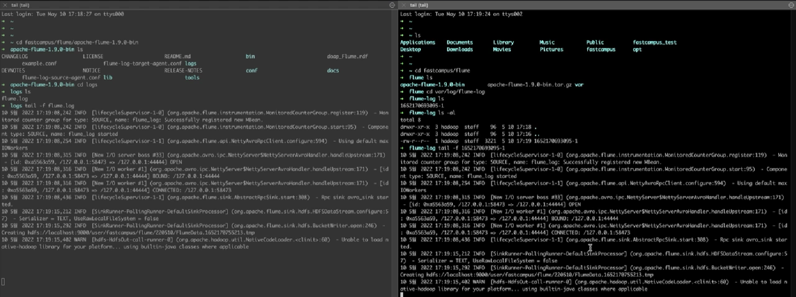

# Flume 실습1

     apache-flume 다운, 압축해제, 시스템환경변수편집  
</img>  
</img>  

    flume 설정파일 만들기 - example.conf  
</img>  

    Flume agent 실행  
</img>  
*flume-ng agent -n a1 -c conf -f example.conf -property flume.root.logger=Debug,console*  

    telenet 실행  
</img>  

    netcat 실행결과  
</img>  

# Flume 실습2

    하둡클러스터 작동
</img>  

    설정파일 생성
</img>  

</img>  
- *target_agent의 이름 AvoroIn*  
- *채널이 두개인 이유는 hdfs와 로컬에 저장할 것이기 때문에 Sink가 2개 필요 = 메모리 채널도 2개*  
- *rollSize = 0 파일크기에 제한을 두지 않음* 
- *rollCount = 10000 log가 10000개 이상 기록되면 rolling 할 것*  
- *rollInterval = 600 600초가 지날 때마다 rolling 할 것*  

        Sink Directory 생성
</img>  

        Flume agent
1. target agent 실행
</img>  
2. source agent 실행
</img>  
</img>  
*source.conf 파일이 실행은 되지만 리눅스 tail -f 명령어는 윈도우 커맨드에서 사용이 불가하기때문에 오류가 생긴다// 해결방법을 찾지 못하였다.*  

        실행결과
</img>  

*리눅스 tail -f 명령어는 log를 실시간으로 계속 보여줄 수 있는 기능이다.*