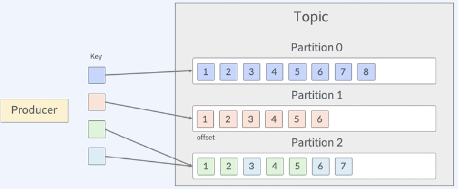

# Apache Kafka 란?
- 분산 이벤트 스트리밍 플랫폼
- 하나의 큰 데이터 파이프라인을 구성할 수 있는 다양한 기능을 제공한다.  
- 이벤트를 실시간으로 수집, 처리, 저장한다.  
</img>  
1. 메시지를 kafka로 보낸다.
2. 메시지를 보관하다가 메시지가 필요한 애플리케이션이나 시스템으로 데이터를 보내준다. *= 여러시스템과 장치들을 연결해주는 역할 수행, 편리하게 데이터를 수집하고 내보낼 수 있는 다양한 커넥터들을 제공하고 있다.*  
- *kafka로 들어오는 메시지들에 대한 스트림처리를 제공*  

> Kafka 설계 원칙
- 이해하기 쉬운 API를 제공 ( = 다양한 시스템과 쉽게 연동하기 위함 )
- 스케일 아웃 아키텍처 ( = 확장 용이 )
- 디스크로 데이터 영속화 ( = 메세지를 디스크에 순차적으로 저장 )  

</img>
</img>  
*Kafka 도입후* : producer는 메시지를 kafka로만 전송, consumer는 kafka로부터 데이터를 바로 가져와서 처리가능하게 되었음. = kafka는 브로커처럼 쓰임  

> Kafaka 아키텍처  

</img>  
*Kafka 클러스터*  
- 여러대의 *브로커* 서버와 *주키퍼*로 구성.
- *브로커*는 데이터를 수신하고 전달하는 역할.
- 브로커 내부에 토픽이 존재하고, 브로커내의 메시지를 토픽별로 관리하며 producer와 consumer는 특정 토픽을 통해 메시지를 서로 주고 받는다. 
- 토픽에 대한 대량의 메시지의 입출력을 처리하기 위해 파티션 단위로 분할해서 저장하고 읽는다.
- *주키퍼*는 브로커들을 하나의 클러스터로 관리한다. (Kafka가 필요로하는 메타데이터들을 관리)
- 최근에는 주키퍼를 사용하지 않는 방향으로 개발 진행중이다.  

*producer : 데이터 생산자*  
- producer API를 이용하여 브로커에 메시지를 전송하는 애플리케이션

*consumer*  
- consunmer API를 이용하여 브로커로부터 메시지를 가져와서 처리하는 애플리케이션
- consunmer API 대신 apache Flink, apache Spark, flume 등을 이용할 수 있다.

> Kafka 구성요소
- Topic, Partition, Message  
</img>  
*Topic* : 메시지를 구분하는 단위, 한 개이상의 partition을 가짐.  
*Partition* : producer가 보낸 메시지, 레코드라는 데이터가 저장되어있다. 분산처리를 가능하게 해줌. *offset*이라는 수신한 메시지에 대한 일련의 번호가 부여된다. 이를 통해 메시지의 위치를 알 수 있다.    
*Message* : offset, key, value가 있다.

- Serialize, Deserialize  
</img>  
*Serialize* : producer가 직렬화하여 데이터를 전송  
*Deserialize* : Topic에서 데이터를 가져올 때 역직렬화한다. 

- Hash Partitioner  
</img>  
*동일한 키를 가지는 메시지는 동일한 파티션으로 전송된다.*  

- Round-Robin partitioner  
</img>  
*메시지의 키를 지정하지 않고 null로 지정하는 경우에 파티션 순서별로 전송된다.*  

- Replication  
</img>  
*장애에 대한 대응을 위한 복제를 통해 복사본을 만든다.*  
*Topic을 생성할 때, *Replication factor = 3* 이라는 복제본 개수를 지정한다.*  