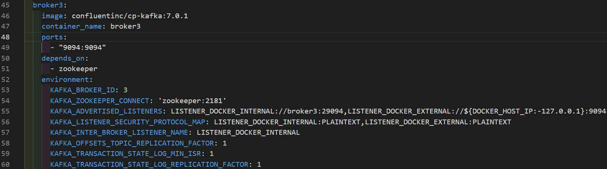
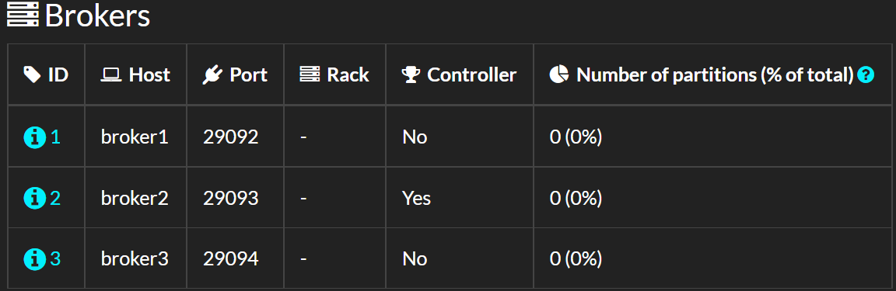

# Kafka 설치  
**Doker 환경에서 클러스터를 구축함*  
## docker-compose.yml 파일 작성과 kafka 클러스터 실행  
*주키퍼 설치를 위한 코드*  
</img>  
*주키퍼 설치, 실행 확인*  
</img>  
</img>  
*kafka 클러스터를 구축하기 위한 코드 (broker1, broker2, broker3)*  
</img>  
</img>  
</img>  
*주키퍼 실행 중단*  
</img>  
*주키퍼 실행(docker-compose up)과 동시에 broker1,2,3 실행*  
</img>  
*주키퍼, broker 실행 확인*  
</img>  
*kafka 클러스터를 위한 webUI 코드*  
</img>  
*전체 실행(docker-compose up)*  
</img>  
* kafdrop에 접속하여(localhost:8080) 전체 실행 확인*  
</img>  

