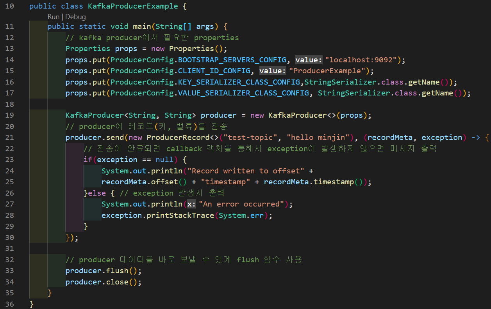

# kafka producer 실습  
1. kafka 클러스터 구동  
        - docker-compose up  
        - *localhost:8080* Kafdrop에 접속  
</img>  
2. kafka producer 작성  
        - kafka-example 메이븐 프로젝트 파일 생성  
        - pom.xml 작성  
</img>  
        - kafka producer java 파일 작성  
</img>  
2. 실행  
        - maven package 실행  
</img>  
        - ls target : kafka-example-1.0.0.jar 파일 생성 확인  
</img>  
        - Producer java 실행  
</img>  
        - Kafdrop에서 메시지 전송 확인  
</img>  

# kafka consumer 실습  
1. kafka Consumer 작성  
        - kafka producer java 파일 작성  
</img>  

2. 실행  
        - maven package 실행  
        - Consumer java 실행  
</img>  
*현재 무한루프를 돌면서 아무런 동작도 하지않음. 데이터가 들어오고있지 않기 때문에 아무것도 나오지않음.*  
        - 새로운 터미널에서 Producer 실행하여 결과 보기  
</img>  

# kafka connect 실습  
> Kafka Connect 란?  
- Kafka에 데이터를 넣거나 kafka에서 데이터를 추출하는 과정을 지원하는 도구  
- Kafka와 다른 데이터 시스템과의 연계를 쉽게 해준다.  
</img>  
- Kafka에 데이터를 넣는 produce side의 connector = *Source connector*  
- 데이터를 출력하는 consumer connector = *Sink connector*  
- 단독모드와 분산모드가 있다.
- hdfs connector, jdbc connector 등 필요한 connector를 찾아서 쓰면 된다.

> Kafka Connect 구성요소  
- Worker : Connector와 Task들이 실행된다.  
- Connector : 데이터를 복사하기위한 작업을 하고, Task들을 관리한다.  
- Task : worker에 분산배치되어서 connector에 정의된 작업을 직접 수행한다.  
- Converter : 데이터를 가져올때 데이터를 변환한다.
- Transform : connector에 의해 메세지를 변경한다. 

> 실습  
- 파일로부터 데이터를 수집하여 source connector를 통해 kafka로 전송하고, 전송된 데이터를 다시 console sink connector를 통해서 화면에 출력하는 실습 (단독모드 사용)  

1. kafka 다운, 압축풀기
2. docker가 띄워있는 상태에서 kafka 클러스터 구동 (docker-compose up)
3. kafka-3.1.0 config 파일 수정  
        - connect-standalone1.properties  
</img>  
        - connect-file-source.properties  
</img>  
file=C:/kafka/test.txt  

4. source connect 실행  
        - connect-standalone 명령 *.\bin\windows\connect-standalone.bat .\config\connect-standalone1.properties .\config\connect-file-source.properties*  
</img>  
</img>  
        - 클러스터 내에 topic 전송 확인  
</img>  
5. console sink connect 실행  
        - connect-standalone2.properties  
</img>  
        - sink connector 실행  
</img>  
        - 명령*.\bin\windows\connect-standalone.bat .\config\connect-standalone2.properties .\config\connect-console-sink.properties*  
        - 결과 : *현재까지 보냈던 파일정보들을 볼 수 있음*  
</img>  
        - 해당 console sink connector에서 메시지 출력 확인  
</img>  

