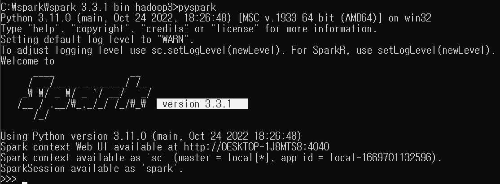
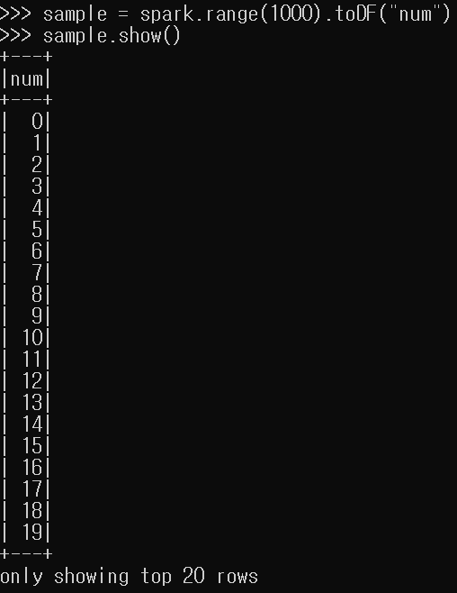
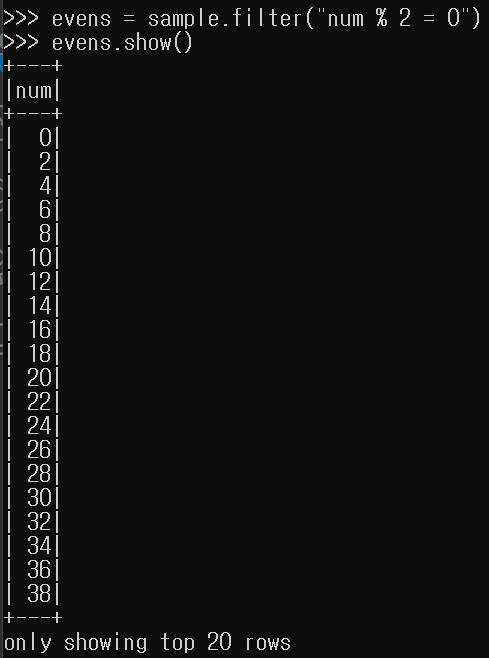
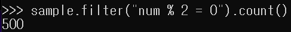
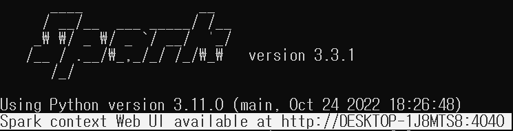
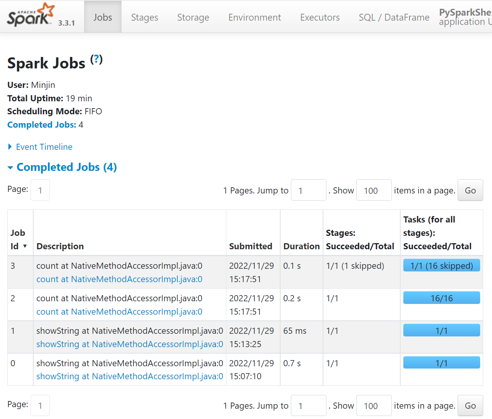

# Spark 설치
java, python 설치되어있어야함.  
- https://dlcdn.apache.org/spark/spark-3.3.1/spark-3.3.1-bin-hadoop3.tgz 설치  
- pyspark 실행  
</img>  
- spark 실행 -> spark 세션을 이용해서 데이터 프레임(sample) 만들기  
</img>  

> transformation 실습  
- 데이터 프레임 필터링 (num이 짝수인 경우만 출력하는데 evens라는 이름으로 저장한다)  
</img>  

> action 실습  
- 데이터 프레임 필터링(num이 짝수인 경우만 출력하는데 count룰 이용해 몇개인지 출력)  
</img>  
*위에서 설정한 1000개 중에 500개가 출력됨*  

> spark Web UI 접속  

</img>  
*localhost:4040 접속*   
</img>  
