# Spark RDD 란?  
- RDD (Resilient Distributed Dataset)  
    - Resilient 회복력 있는 : 장애가 발생하여 메모리에 있는 데이터가 유실되더라도 원래대로 복구할 수 있음을 의미  
    - Distributed 분산된 : 데이터를 처리하기위한 컬렉션이 하나의 머신에만 존재하지 않고 여러 머신에 분산되어 있음을 의미  
    - Dataset : 데이터를 처리하기위한 집합  

- RDD 특징  
    - Immutable : 변하지 않는다. 아예 새로운 RDD를 생성한다. 
    - Resilient 
    - Distributed : 분산되어있는 RDD를 이용하여 데이터 처리

- RDD를 이용한 개발  
    - 계보(Lineage)를 directed acyclic graph(DAG)로 디자인  
</img>  
*계보 : 최종 데이터를 생성하기위한 과정을 담아둔 것이며, 특정 위치에 RDD가 어떻게 생성되었는지 알 수 있다.*  
- Transformation 연산자  
    - 좁은 의존성 : 각각의 파티션의 결과가 1:1로 매핑됨(map, filter와 같은 연산)   
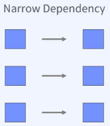</img>  
    - 넓은 의존성 : 하나의 입력 파티션이 여러 파티션에 영향을 미친다. 1:N으로 입력 파티션과 출력파티션이 연결되어있다.(shuffle)  
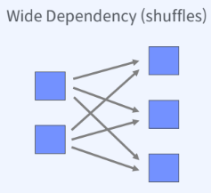</img>  

- Lazy Evaluation
    - Transformation을 통한 새로운 RDD 생성은 아무일도 일어나지 않는다.
    - RDD 계보만 생성된다.
    - Action 연산자를 수행하면 그때 실제 연산을 시작한다.  
RDD의 계보를 통해 현재 클러스터의 상태를 고려하여 실행 계획의 최적화가 가능  

# Spark RDD 실습  
- dataset 파일 준비  
- pyspark 실행  
- dataset/MovieLens/movies.csv 파일에서 상위 5개 파일 가져오기    
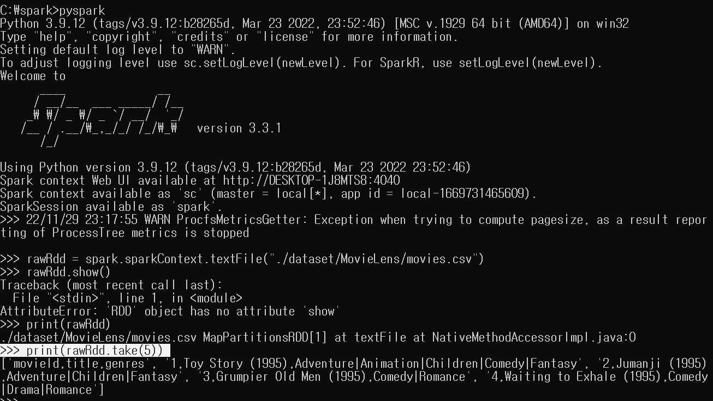</img>  
- 해당 RDD의 첫번째 데이터는 해더 정보를 가지고 있다.  
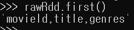</img>  
- 해더 정보를 제외한 RDD를 생성, 필터  
*람다 함수를 이용한 row가 해더와 다르다면, 첫번째 데이터가 더이상 해더 정보가 아닌 영화정보.*  
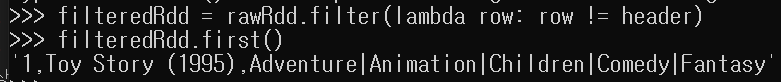</img>  
- ','를 기준으로 분리하여 리스트 형태로 저장되도록 처리하기  
*[Id, 영화제목, 장르]*  
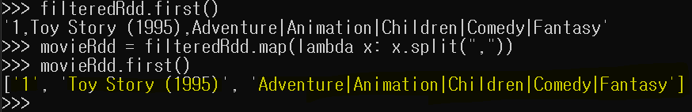</img>  
- 장르가 Comedy인 영화를 필터하여 5개 정보를 가져오기  
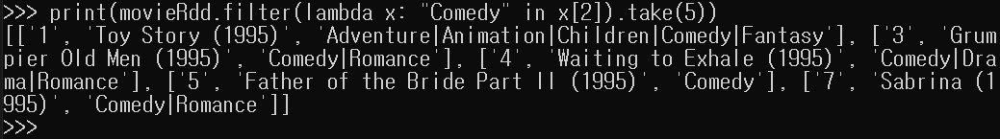</img>  
- 기존에 필터 연산을 적용한 결과에 장르가 Comedy인 영화를 Id 기준으로 정렬하기  
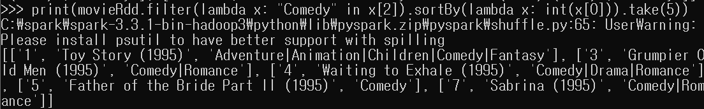</img>  
- 처리된 결과를 output file로 저장  
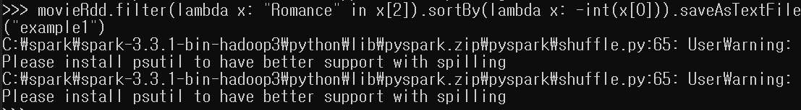</img>  
*장르가 로맨스인 영화 Id를 내림차순으로 정렬하여 저장*  
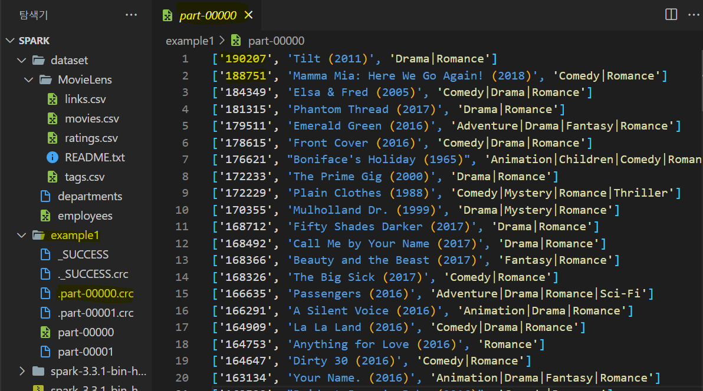</img>  
*두개의 파일이 만들어지는데, 하나의 파일로 만드는 방법* -> repartition  
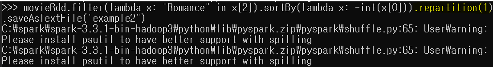</img>  
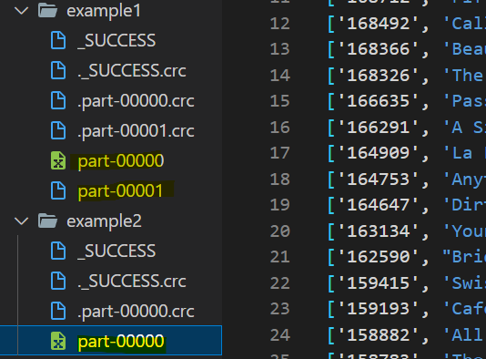</img>  

