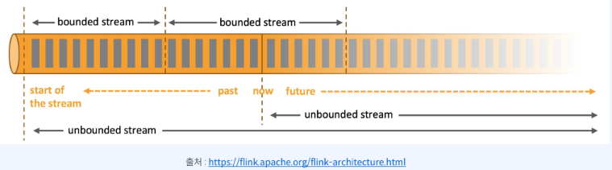
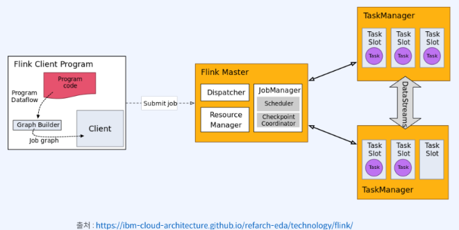
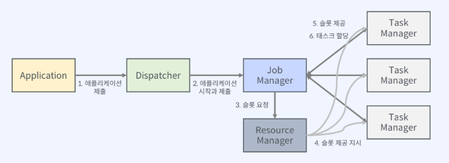
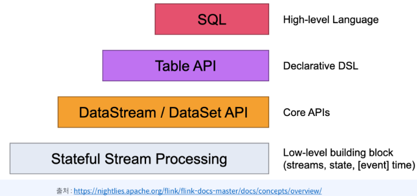
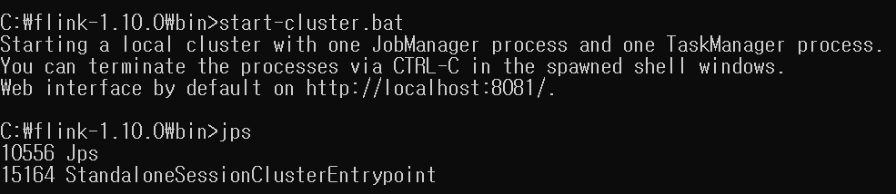
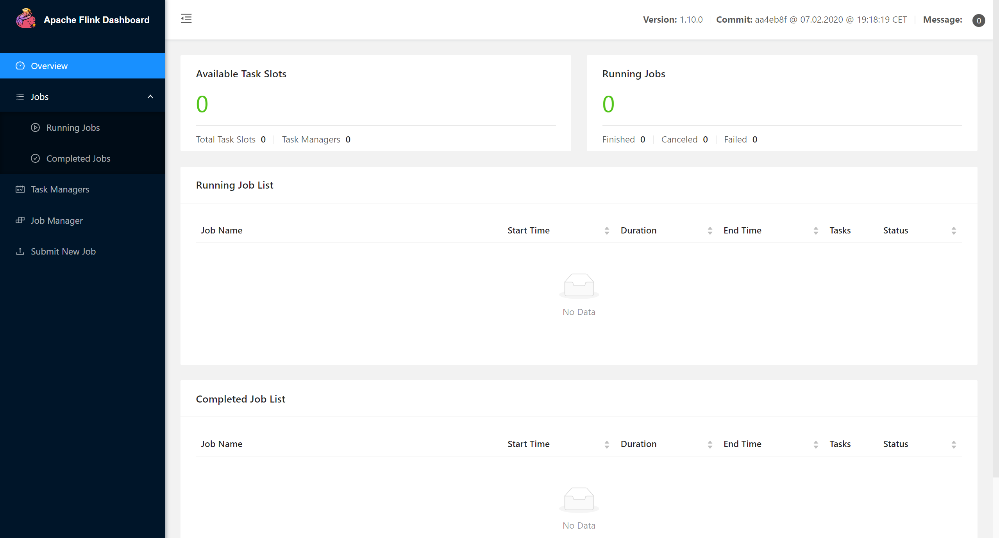

# Flink  
> Apache Flink 란?  
- 분산 스트림 처리 엔진 및 프레임워크  
- 장애가 발생했을 때, 극복할 수 있는 매커니즘 제공  

</img>  
- Unbounded stream : 무한한 데이터셋을 의미  
- bounded stream : 유한한 데이터셋을 의미  

> Flink 아키텍처  

</img>  
- 마스터 & 워커의 구조  
- 컴포넌트 : *jobManager, resourseManager, Dispacher, TaskManager*  
- *jobManager : 애플리케이션 실행을 제어하는 마스터 프로세스, 클라이언트는 jobManager로 애플리케이션을 제출한다. 그리고 jobManager는 resourceManager에게 Task를 실행할 필요한 자원을 요청하고, resourceManager로부터 TaskSlot울 할당 받는다.*  
- *resourceManager : flink의 실행단위인 TaskSlot을 관리하는 책임을 가진다. 빈 슬롯을 jobManager에게 할당하도록 TaskManager에게 지시한다. 자원을 반환하는 업무도 함께 수행한다.*  
    - 자원제공자 : Yarn, Mesos, Kubenetes, Standalone cluster  
- *TaskManager : 실제로 Task를 수행하는 워커이다. 각 TaskManager는 여러개의 슬롯을 가지며, TaskManager가 시작할 때 모든 슬롯을 resourceManager에게 등록한다.*  
- *Dispacher : 실행을 위해 flink 애플리케이션을 제출하고, 제출된 각 작업에 대해 새로운 job 마스터를 시작하는 Rest 인터페이스를 제공한다. 또한 flink webUI를 실행하여 작업실행에 대한 정보를 제공한다.*  

> Flink 실행과정  

</img>  
- 클라이언트에서 애플리케이션을 Dispacher에게 제출
- Dispacher가 애플리케이션 실행
- jobManager는 resourceManager에게 슬롯을 요청
- resourceManager는 TaskManager에게 태스크 슬롯을 제공해달라고 요청함
- TaskManager가 슬롯을 jobManager에게 제공한다.
- jobManager는 해당슬롯에 테스크를 할당하여 애플리케이션을 실행한다.

> 실행 모델
- Streaming
- Batch

> Flink API  

*다양한 API 제공*  
</img>  

> Flink 주요 특징  
- 상태 관리 지원 (연산자 상태, 키 상태)  
- 이벤트 타임 기반 처리  
- 다양한 윈도우 연산 제공  
- 내결함성 제공  
- 세이브 포인트 제공   

# 설치  
https://archive.apache.org/dist/flink/flink-1.9.3/

- 클러스터 실행 (start-cluster.bat)  
</img>  
*localhost:8081 접속*  
</img>  

> examples 디렉터리 > streaming > WordCount job을 flink 클러스터에 제출하는 실습  

1. flink run examples/streaming/WordCount.jar  
</img>  
2. localhost:8081 확인 (두개의 오퍼레이터, log)  
</img>  
</img>  
</img>  

